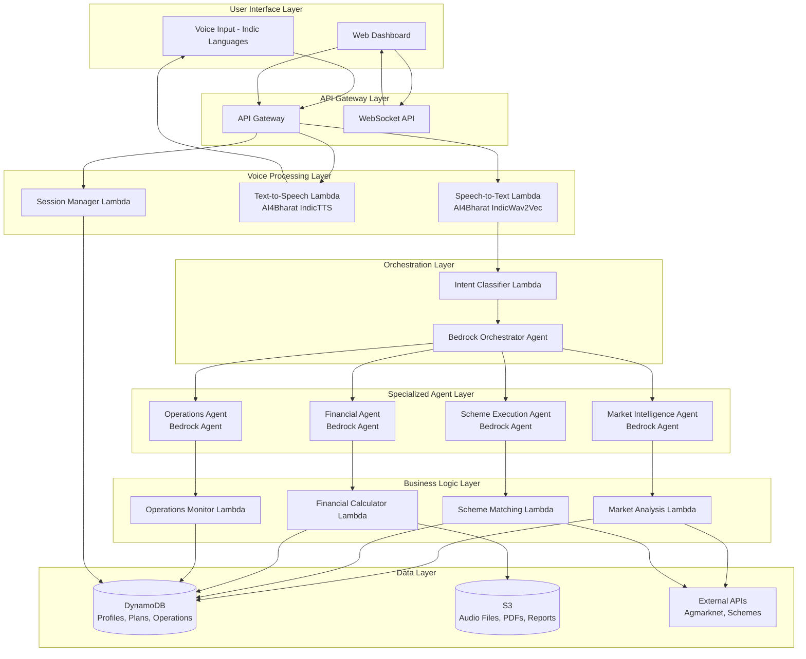
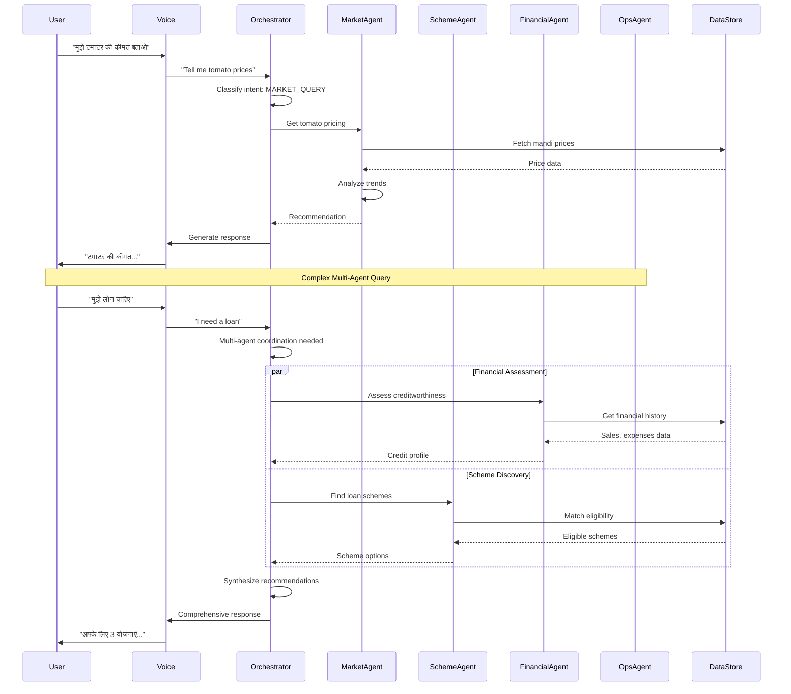

# Design Document: GramSaarthi AI

## Overview

GramSaarthi AI is a voice-first rural growth orchestration platform that leverages multi-agent AI architecture to provide comprehensive business support to rural enterprises. The platform combines AWS Bedrock's multi-agent orchestration capabilities with AI4Bharat's Indic language processing to deliver market intelligence, scheme execution guidance, financial readiness support, and operational monitoring through natural voice interactions.

### Design Philosophy

The design prioritizes three key principles for hackathon success:

1. **Demonstrable Innovation**: Multi-agent orchestration with visible coordination flows
2. **Practical Implementation**: Serverless architecture enabling rapid deployment within 2 days
3. **User-Centric Experience**: Voice-first interaction removing literacy and language barriers

### Technology Stack

- **Backend**: Python 3.9+ with AWS Lambda for serverless compute
- **LLM Orchestration**: Amazon Bedrock Agents with Claude 3 models
- **Voice Processing**: AI4Bharat IndicTrans2, IndicWav2Vec, IndicTTS
- **API Layer**: AWS API Gateway with REST endpoints
- **Data Storage**: DynamoDB (NoSQL), S3 (file storage)
- **Workflow Orchestration**: AWS Step Functions for complex multi-step processes
- **Monitoring**: CloudWatch for logs and metrics
- **Frontend Dashboard**: React with real-time WebSocket updates

## Architecture

### High-Level System Architecture



### Multi-Agent Orchestration Flow



### Component Interaction Patterns

**Pattern 1: Simple Query-Response**
- User voice input → STT → Intent classification → Single agent → Response → TTS → User
- Used for: Market price queries, scheme lookups, status checks
- Latency target: < 3 seconds end-to-end

**Pattern 2: Multi-Turn Conversation**
- Maintains session state in DynamoDB
- Agent can ask clarifying questions
- Context preserved across turns
- Used for: Profile registration, financial data collection
- Session timeout: 5 minutes of inactivity

**Pattern 3: Multi-Agent Coordination**
- Orchestrator coordinates multiple agents
- Parallel execution where possible
- Sequential execution when dependencies exist
- Results synthesized into coherent response
- Used for: Complex queries requiring multiple domains

**Pattern 4: Proactive Alerts**
- Background monitoring via scheduled Lambda
- Triggers voice call via AWS Connect
- User can respond to continue conversation
- Used for: Price alerts, deadline reminders, threshold breaches

## Components and Interfaces

### 1. Voice Processing Components

#### Speech-to-Text Service
```python
class SpeechToTextService:
    """
    Converts Indic language audio to text using AI4Bharat models.
    """
    
    def transcribe(
        self,
        audio_data: bytes,
        language_code: str,  # 'hi', 'ta', 'te'
        session_id: str
    ) -> TranscriptionResult:
        """
        Transcribe audio to text.
        
        Returns:
            TranscriptionResult with text, confidence, language
        """
        pass
    
    def detect_language(self, audio_data: bytes) -> str:
        """Auto-detect Indic language from audio."""
        pass
```

#### Text-to-Speech Service
```python
class TextToSpeechService:
    """
    Converts text to natural Indic language speech using AI4Bharat models.
    """
    
    def synthesize(
        self,
        text: str,
        language_code: str,
        voice_profile: str = "female_default"
    ) -> bytes:
        """
        Generate speech audio from text.
        
        Returns:
            Audio bytes in WAV format
        """
        pass
    
    def get_supported_voices(self, language_code: str) -> List[str]:
        """Get available voice profiles for language."""
        pass
```

#### Session Manager
```python
class VoiceSessionManager:
    """
    Manages voice session state and context.
    """
    
    def create_session(
        self,
        user_id: str,
        language_code: str
    ) -> VoiceSession:
        """Create new voice session."""
        pass
    
    def get_session(self, session_id: str) -> Optional[VoiceSession]:
        """Retrieve active session."""
        pass
    
    def update_context(
        self,
        session_id: str,
        turn_data: ConversationTurn
    ) -> None:
        """Add conversation turn to session context."""
        pass
    
    def terminate_session(self, session_id: str) -> None:
        """End session and cleanup."""
        pass
```

### 2. Orchestration Components

#### Bedrock Orchestrator Agent
```python
class BedrockOrchestrator:
    """
    Main orchestrator using AWS Bedrock Agents.
    Routes queries to specialized agents and coordinates responses.
    """
    
    def process_query(
        self,
        query: str,
        user_context: UserContext,
        session_id: str
    ) -> OrchestrationResult:
        """
        Process user query through multi-agent system.
        
        Steps:
        1. Classify intent
        2. Determine required agents
        3. Execute agent calls (parallel or sequential)
        4. Synthesize response
        """
        pass
    
    def classify_intent(self, query: str) -> Intent:
        """Classify user intent to route to appropriate agent."""
        pass
    
    def coordinate_agents(
        self,
        intent: Intent,
        agents: List[AgentType],
        context: UserContext
    ) -> Dict[AgentType, AgentResponse]:
        """Execute and coordinate multiple agent calls."""
        pass
```

#### Intent Classifier
```python
class IntentClassifier:
    """
    Classifies user queries into actionable intents.
    """
    
    INTENT_TYPES = [
        "MARKET_PRICE_QUERY",
        "SCHEME_DISCOVERY",
        "SCHEME_APPLICATION",
        "FINANCIAL_SUMMARY",
        "OPERATIONAL_STATUS",
        "PROFILE_UPDATE",
        "GENERAL_QUERY"
    ]
    
    def classify(
        self,
        query: str,
        conversation_history: List[ConversationTurn]
    ) -> ClassificationResult:
        """
        Classify query intent with confidence score.
        
        Returns:
            ClassificationResult with intent, confidence, entities
        """
        pass
    
    def extract_entities(
        self,
        query: str,
        intent: str
    ) -> Dict[str, Any]:
        """Extract relevant entities from query."""
        pass
```

### 3. Specialized Agent Components

#### Market Intelligence Agent
```python
class MarketIntelligenceAgent:
    """
    Bedrock Agent for market analysis and pricing optimization.
    """
    
    def get_pricing_recommendation(
        self,
        commodity: str,
        location: str,
        current_price: Optional[float] = None
    ) -> PricingRecommendation:
        """
        Analyze market data and provide pricing recommendation.
        
        Returns:
            PricingRecommendation with suggested price, reasoning, trends
        """
        pass
    
    def analyze_price_trends(
        self,
        commodity: str,
        days: int = 30
    ) -> PriceTrendAnalysis:
        """Analyze historical price trends."""
        pass
    
    def find_best_market(
        self,
        commodity: str,
        user_location: Location,
        radius_km: int = 50
    ) -> List[MarketOption]:
        """Find best markets within radius."""
        pass
    
    def check_price_alerts(
        self,
        enterprise_id: str
    ) -> List[PriceAlert]:
        """Check if any price alerts should be triggered."""
        pass
```

#### Scheme Execution Agent
```python
class SchemeExecutionAgent:
    """
    Bedrock Agent for government scheme discovery and execution.
    """
    
    def discover_schemes(
        self,
        enterprise_profile: EnterpriseProfile
    ) -> List[SchemeMatch]:
        """
        Find eligible schemes based on enterprise profile.
        
        Returns:
            List of schemes ranked by relevance and benefit
        """
        pass
    
    def generate_action_plan(
        self,
        scheme_id: str,
        enterprise_id: str
    ) -> ActionPlan:
        """
        Generate step-by-step action plan for scheme application.
        
        Returns:
            ActionPlan with steps, documents, deadlines, contacts
        """
        pass
    
    def track_progress(
        self,
        action_plan_id: str
    ) -> PlanProgress:
        """Get current progress on action plan."""
        pass
    
    def update_step_status(
        self,
        action_plan_id: str,
        step_id: str,
        status: StepStatus
    ) -> None:
        """Mark step as complete and advance plan."""
        pass
```

#### Financial Agent
```python
class FinancialAgent:
    """
    Bedrock Agent for financial analysis and credit readiness.
    """
    
    def collect_financial_data(
        self,
        enterprise_id: str,
        conversation_turns: List[ConversationTurn]
    ) -> FinancialData:
        """
        Extract financial data from voice conversation.
        
        Collects: sales, expenses, inventory, assets, liabilities
        """
        pass
    
    def generate_financial_summary(
        self,
        enterprise_id: str
    ) -> FinancialSummary:
        """
        Generate comprehensive financial summary.
        
        Returns:
            FinancialSummary with metrics, ratios, trends, recommendations
        """
        pass
    
    def calculate_creditworthiness(
        self,
        financial_data: FinancialData
    ) -> CreditworthinessScore:
        """Calculate credit indicators."""
        pass
    
    def export_summary_pdf(
        self,
        summary: FinancialSummary
    ) -> str:
        """
        Export summary as PDF to S3.
        
        Returns:
            S3 URL for shareable PDF
        """
        pass
```

#### Operations Agent
```python
class OperationsAgent:
    """
    Bedrock Agent for operational monitoring and replanning.
    """
    
    def track_operations(
        self,
        enterprise_id: str,
        operational_data: OperationalData
    ) -> None:
        """Record operational metrics."""
        pass
    
    def check_inventory_alerts(
        self,
        enterprise_id: str
    ) -> List[InventoryAlert]:
        """Check for low inventory conditions."""
        pass
    
    def detect_plan_deviations(
        self,
        enterprise_id: str
    ) -> List[PlanDeviation]:
        """Detect deviations from planned metrics."""
        pass
    
    def generate_weekly_report(
        self,
        enterprise_id: str
    ) -> WeeklyReport:
        """Generate weekly operational summary."""
        pass
    
    def recommend_adjustments(
        self,
        deviation: PlanDeviation
    ) -> List[Recommendation]:
        """Recommend corrective actions."""
        pass
```

### 4. Business Logic Components

#### Market Analysis Service
```python
class MarketAnalysisService:
    """
    Core business logic for market intelligence.
    """
    
    def fetch_mandi_prices(
        self,
        commodity: str,
        state: str,
        days: int = 30
    ) -> List[MandiPrice]:
        """Fetch prices from Agmarknet API or cache."""
        pass
    
    def calculate_price_statistics(
        self,
        prices: List[MandiPrice]
    ) -> PriceStatistics:
        """Calculate mean, median, std dev, trends."""
        pass
    
    def detect_price_anomalies(
        self,
        prices: List[MandiPrice]
    ) -> List[PriceAnomaly]:
        """Detect unusual price movements."""
        pass
```

#### Scheme Matching Service
```python
class SchemeMatchingService:
    """
    Core business logic for scheme eligibility matching.
    """
    
    def match_eligibility(
        self,
        profile: EnterpriseProfile,
        scheme: Scheme
    ) -> EligibilityResult:
        """
        Check if enterprise meets scheme eligibility criteria.
        
        Returns:
            EligibilityResult with match score, missing criteria
        """
        pass
    
    def rank_schemes(
        self,
        matches: List[EligibilityResult]
    ) -> List[SchemeMatch]:
        """Rank schemes by relevance and benefit."""
        pass
    
    def generate_plan_steps(
        self,
        scheme: Scheme
    ) -> List[ActionStep]:
        """Generate action steps from scheme requirements."""
        pass
```

#### Financial Calculator Service
```python
class FinancialCalculatorService:
    """
    Core business logic for financial calculations.
    """
    
    def calculate_profit_margin(
        self,
        revenue: float,
        expenses: float
    ) -> float:
        """Calculate profit margin percentage."""
        pass
    
    def calculate_cash_flow(
        self,
        financial_data: FinancialData,
        months: int = 3
    ) -> CashFlowProjection:
        """Project cash flow for coming months."""
        pass
    
    def calculate_debt_to_income(
        self,
        financial_data: FinancialData
    ) -> float:
        """Calculate debt-to-income ratio."""
        pass
    
    def assess_revenue_stability(
        self,
        sales_history: List[SalesRecord]
    ) -> StabilityScore:
        """Assess revenue stability over time."""
        pass
```

### 5. API Endpoints

#### Voice Interaction Endpoints
```
POST /api/v1/voice/session/start
- Create new voice session
- Request: { user_id, language_code }
- Response: { session_id, session_token }

POST /api/v1/voice/transcribe
- Transcribe audio to text
- Request: { session_id, audio_data (base64), language_code }
- Response: { text, confidence, language }

POST /api/v1/voice/synthesize
- Convert text to speech
- Request: { text, language_code, voice_profile }
- Response: { audio_data (base64), duration }

POST /api/v1/voice/query
- Process voice query end-to-end
- Request: { session_id, audio_data }
- Response: { response_text, response_audio, agent_used }

DELETE /api/v1/voice/session/{session_id}
- Terminate voice session
```

#### Enterprise Profile Endpoints
```
POST /api/v1/enterprises
- Register new enterprise
- Request: { type, products, location, contact }
- Response: { enterprise_id, profile }

GET /api/v1/enterprises/{enterprise_id}
- Get enterprise profile
- Response: { profile, last_updated }

PUT /api/v1/enterprises/{enterprise_id}
- Update enterprise profile
- Request: { updates }
- Response: { updated_profile }

DELETE /api/v1/enterprises/{enterprise_id}
- Delete enterprise data
```

#### Market Intelligence Endpoints
```
GET /api/v1/market/prices
- Get current mandi prices
- Query params: commodity, state, market
- Response: { prices, last_updated }

GET /api/v1/market/recommendations/{enterprise_id}
- Get pricing recommendations
- Response: { recommendations, reasoning }

GET /api/v1/market/trends
- Get price trends
- Query params: commodity, days
- Response: { trends, statistics }
```

#### Scheme Endpoints
```
GET /api/v1/schemes/discover/{enterprise_id}
- Discover eligible schemes
- Response: { schemes, match_scores }

POST /api/v1/schemes/action-plan
- Generate action plan
- Request: { enterprise_id, scheme_id }
- Response: { action_plan_id, steps }

GET /api/v1/schemes/action-plan/{plan_id}
- Get action plan progress
- Response: { plan, progress, next_steps }

PUT /api/v1/schemes/action-plan/{plan_id}/step/{step_id}
- Update step status
- Request: { status, notes }
```

#### Financial Endpoints
```
POST /api/v1/financial/data/{enterprise_id}
- Submit financial data
- Request: { sales, expenses, inventory, period }

GET /api/v1/financial/summary/{enterprise_id}
- Get financial summary
- Response: { summary, metrics, pdf_url }

GET /api/v1/financial/creditworthiness/{enterprise_id}
- Get creditworthiness assessment
- Response: { score, indicators, recommendations }
```

#### Operations Endpoints
```
POST /api/v1/operations/track/{enterprise_id}
- Record operational data
- Request: { sales, inventory, cash_flow, date }

GET /api/v1/operations/alerts/{enterprise_id}
- Get active alerts
- Response: { inventory_alerts, deviation_alerts }

GET /api/v1/operations/report/{enterprise_id}
- Get weekly report
- Query params: week_start_date
- Response: { report, metrics, recommendations }
```

#### Analytics Dashboard Endpoints
```
GET /api/v1/analytics/overview
- Get platform overview metrics
- Response: { active_users, queries_processed, agent_stats }

GET /api/v1/analytics/sessions
- Get recent voice sessions
- Response: { sessions, transcripts }

GET /api/v1/analytics/impact
- Get impact metrics
- Response: { pricing_improvements, schemes_accessed, summaries_generated }

WebSocket /api/v1/analytics/live
- Real-time analytics updates
```

## Data Models

### DynamoDB Table Structures

#### EnterpriseProfiles Table
```python
{
    "PK": "ENTERPRISE#{enterprise_id}",
    "SK": "PROFILE",
    "enterprise_id": "string (UUID)",
    "type": "string (SHG|FPO|COOPERATIVE|MSME)",
    "name": "string",
    "products": ["string"],  # List of products/commodities
    "location": {
        "state": "string",
        "district": "string",
        "block": "string",
        "village": "string",
        "coordinates": {
            "lat": "number",
            "lon": "number"
        }
    },
    "contact": {
        "phone": "string",
        "alternate_phone": "string",
        "preferred_language": "string (hi|ta|te)"
    },
    "registration_date": "string (ISO 8601)",
    "last_updated": "string (ISO 8601)",
    "metadata": {
        "member_count": "number",
        "annual_turnover": "number",
        "primary_market": "string"
    }
}
```

#### VoiceSessions Table
```python
{
    "PK": "SESSION#{session_id}",
    "SK": "METADATA",
    "session_id": "string (UUID)",
    "enterprise_id": "string",
    "language_code": "string",
    "start_time": "string (ISO 8601)",
    "last_activity": "string (ISO 8601)",
    "status": "string (ACTIVE|COMPLETED|TIMEOUT)",
    "conversation_turns": [
        {
            "turn_id": "number",
            "timestamp": "string (ISO 8601)",
            "user_audio_s3_key": "string",
            "user_text": "string",
            "intent": "string",
            "agent_used": "string",
            "response_text": "string",
            "response_audio_s3_key": "string"
        }
    ],
    "context": {
        "current_topic": "string",
        "entities": "map",
        "pending_questions": ["string"]
    },
    "ttl": "number (Unix timestamp)"  # Auto-delete after 7 days
}
```

#### ActionPlans Table
```python
{
    "PK": "ENTERPRISE#{enterprise_id}",
    "SK": "PLAN#{plan_id}",
    "plan_id": "string (UUID)",
    "enterprise_id": "string",
    "scheme_id": "string",
    "scheme_name": "string",
    "created_date": "string (ISO 8601)",
    "status": "string (IN_PROGRESS|COMPLETED|ABANDONED)",
    "steps": [
        {
            "step_id": "string",
            "step_number": "number",
            "description": "string",
            "required_documents": ["string"],
            "deadline": "string (ISO 8601)",
            "status": "string (PENDING|IN_PROGRESS|COMPLETED)",
            "completed_date": "string (ISO 8601)",
            "notes": "string"
        }
    ],
    "progress_percentage": "number",
    "next_reminder_date": "string (ISO 8601)",
    "contact_info": {
        "office_name": "string",
        "phone": "string",
        "address": "string"
    }
}
```

#### FinancialData Table
```python
{
    "PK": "ENTERPRISE#{enterprise_id}",
    "SK": "FINANCIAL#{period}",  # period: YYYY-MM
    "enterprise_id": "string",
    "period": "string (YYYY-MM)",
    "recorded_date": "string (ISO 8601)",
    "sales": {
        "total_revenue": "number",
        "product_breakdown": [
            {
                "product": "string",
                "quantity": "number",
                "revenue": "number"
            }
        ]
    },
    "expenses": {
        "total_expenses": "number",
        "categories": {
            "raw_materials": "number",
            "labor": "number",
            "transport": "number",
            "utilities": "number",
            "other": "number"
        }
    },
    "inventory": {
        "products": [
            {
                "product": "string",
                "quantity": "number",
                "value": "number"
            }
        ],
        "total_value": "number"
    },
    "cash_flow": {
        "opening_balance": "number",
        "closing_balance": "number",
        "receivables": "number",
        "payables": "number"
    },
    "calculated_metrics": {
        "profit_margin": "number",
        "net_profit": "number",
        "cash_flow_change": "number"
    }
}
```

#### OperationalData Table
```python
{
    "PK": "ENTERPRISE#{enterprise_id}",
    "SK": "OPS#{date}",  # date: YYYY-MM-DD
    "enterprise_id": "string",
    "date": "string (YYYY-MM-DD)",
    "recorded_timestamp": "string (ISO 8601)",
    "daily_sales": {
        "total": "number",
        "transactions": "number",
        "products_sold": [
            {
                "product": "string",
                "quantity": "number",
                "revenue": "number"
            }
        ]
    },
    "inventory_snapshot": {
        "products": [
            {
                "product": "string",
                "quantity": "number",
                "reorder_level": "number",
                "alert_triggered": "boolean"
            }
        ]
    },
    "cash_position": "number",
    "notes": "string"
}
```

#### Schemes Table
```python
{
    "PK": "SCHEME#{scheme_id}",
    "SK": "METADATA",
    "scheme_id": "string (UUID)",
    "name": "string",
    "name_local": "map (language_code -> translated_name)",
    "description": "string",
    "description_local": "map",
    "scheme_type": "string (LOAN|SUBSIDY|GRANT|TRAINING)",
    "authority": "string (CENTRAL|STATE)",
    "state": "string (optional, for state schemes)",
    "eligibility_criteria": {
        "enterprise_types": ["string"],
        "min_turnover": "number (optional)",
        "max_turnover": "number (optional)",
        "sectors": ["string"],
        "other_requirements": ["string"]
    },
    "benefits": {
        "financial_benefit": "string",
        "benefit_amount": "number (optional)",
        "other_benefits": ["string"]
    },
    "application_process": {
        "required_documents": ["string"],
        "application_url": "string",
        "contact_info": {
            "office": "string",
            "phone": "string",
            "email": "string"
        }
    },
    "deadlines": {
        "application_deadline": "string (ISO 8601, optional)",
        "is_ongoing": "boolean"
    },
    "last_updated": "string (ISO 8601)",
    "source_url": "string"
}
```

#### MandiPrices Table
```python
{
    "PK": "COMMODITY#{commodity_name}",
    "SK": "PRICE#{state}#{market}#{date}",
    "commodity_name": "string",
    "state": "string",
    "district": "string",
    "market_name": "string",
    "date": "string (YYYY-MM-DD)",
    "price_min": "number",
    "price_max": "number",
    "price_modal": "number",  # Most common price
    "unit": "string (quintal|kg)",
    "arrivals": "number (quantity arrived)",
    "source": "string (agmarknet)",
    "fetched_timestamp": "string (ISO 8601)",
    "ttl": "number (Unix timestamp)"  # Auto-delete after 90 days
}
```

#### Alerts Table
```python
{
    "PK": "ENTERPRISE#{enterprise_id}",
    "SK": "ALERT#{alert_id}",
    "alert_id": "string (UUID)",
    "enterprise_id": "string",
    "alert_type": "string (PRICE|INVENTORY|DEADLINE|CASH_FLOW|SCHEME)",
    "severity": "string (INFO|WARNING|CRITICAL)",
    "title": "string",
    "message": "string",
    "created_date": "string (ISO 8601)",
    "status": "string (PENDING|SENT|ACKNOWLEDGED|DISMISSED)",
    "delivery_method": "string (VOICE_CALL|SMS|IN_APP)",
    "delivery_timestamp": "string (ISO 8601, optional)",
    "related_entity_id": "string (optional)",  # scheme_id, plan_id, etc.
    "action_required": "boolean",
    "ttl": "number (Unix timestamp)"  # Auto-delete after 30 days
}
```

#### AnalyticsEvents Table
```python
{
    "PK": "EVENT#{date}",  # date: YYYY-MM-DD
    "SK": "#{timestamp}#{event_id}",
    "event_id": "string (UUID)",
    "timestamp": "string (ISO 8601)",
    "event_type": "string (QUERY|REGISTRATION|ALERT|PLAN_CREATED|etc)",
    "enterprise_id": "string (optional)",
    "session_id": "string (optional)",
    "agent_used": "string (optional)",
    "intent": "string (optional)",
    "latency_ms": "number",
    "success": "boolean",
    "error_message": "string (optional)",
    "metadata": "map",
    "ttl": "number (Unix timestamp)"  # Auto-delete after 90 days
}
```

### S3 Bucket Structure

```
gramsaarthi-data/
├── audio/
│   ├── sessions/
│   │   └── {session_id}/
│   │       ├── user_{turn_id}.wav
│   │       └── response_{turn_id}.wav
│   └── alerts/
│       └── {alert_id}.wav
├── documents/
│   ├── financial-summaries/
│   │   └── {enterprise_id}/
│   │       └── summary_{date}.pdf
│   └── reports/
│       └── {enterprise_id}/
│           └── weekly_{date}.pdf
├── cache/
│   ├── mandi-prices/
│   │   └── {commodity}_{state}_{date}.json
│   └── schemes/
│       └── schemes_snapshot_{date}.json
└── demo/
    ├── sample-profiles.json
    └── sample-scenarios.json
```

### Data Access Patterns

#### Pattern 1: Get Enterprise Profile
```
Query: PK = "ENTERPRISE#{enterprise_id}" AND SK = "PROFILE"
Index: Primary Key
Expected Latency: < 10ms
```

#### Pattern 2: Get Active Voice Session
```
Query: PK = "SESSION#{session_id}" AND SK = "METADATA"
Index: Primary Key
Expected Latency: < 10ms
```

#### Pattern 3: Get Enterprise Action Plans
```
Query: PK = "ENTERPRISE#{enterprise_id}" AND SK begins_with "PLAN#"
Index: Primary Key
Expected Latency: < 20ms
```

#### Pattern 4: Get Financial History
```
Query: PK = "ENTERPRISE#{enterprise_id}" AND SK begins_with "FINANCIAL#"
Index: Primary Key
Expected Latency: < 50ms (multiple months)
```

#### Pattern 5: Get Recent Mandi Prices
```
Query: PK = "COMMODITY#{commodity}" AND SK begins_with "PRICE#{state}#"
Index: Primary Key
Expected Latency: < 30ms
```

#### Pattern 6: Get Enterprise Alerts
```
Query: PK = "ENTERPRISE#{enterprise_id}" AND SK begins_with "ALERT#"
Filter: status = "PENDING"
Index: Primary Key
Expected Latency: < 20ms
```

#### Pattern 7: Get Daily Analytics Events
```
Query: PK = "EVENT#{date}"
Index: Primary Key
Expected Latency: < 100ms (full day scan)
```

### Global Secondary Indexes

#### GSI1: AlertsByStatus
```
PK: alert_status (PENDING|SENT|etc)
SK: created_date
Purpose: Query all pending alerts for batch processing
```

#### GSI2: SessionsByEnterprise
```
PK: enterprise_id
SK: start_time
Purpose: Get all sessions for an enterprise
```

#### GSI3: SchemesByType
```
PK: scheme_type
SK: last_updated
Purpose: Browse schemes by category
```


## Correctness Properties

*A property is a characteristic or behavior that should hold true across all valid executions of a system—essentially, a formal statement about what the system should do. Properties serve as the bridge between human-readable specifications and machine-verifiable correctness guarantees.*

### Property 1: Speech-to-Text Conversion Completeness

*For any* valid Indic language audio input in supported languages (Hindi, Tamil, Telugu), the Voice_Interface should successfully convert the audio to text and return a non-empty transcription result.

**Validates: Requirements 1.1**

### Property 2: Text-to-Speech Round Trip Preserves Meaning

*For any* text string in supported Indic languages, converting text to speech and then back to text should preserve the semantic meaning of the original text (allowing for minor transcription variations).

**Validates: Requirements 1.2**

### Property 3: Session Context Preservation

*For any* voice session with multiple conversation turns, context information (entities, topics, previous responses) added in earlier turns should be accessible and retrievable in subsequent turns within the same session.

**Validates: Requirements 1.5, 7.3**

### Property 4: Enterprise Profile Round Trip

*For any* valid enterprise profile data, storing the profile to DynamoDB and then retrieving it should return data equivalent to the original profile.

**Validates: Requirements 2.2**

### Property 5: Profile Update Persistence

*For any* existing enterprise profile and any valid update operation, applying the update should result in the modified fields being persisted and retrievable in subsequent queries.

**Validates: Requirements 2.4**

### Property 6: Agricultural Enterprise Mandi Linkage

*For any* enterprise profile where the enterprise type is agricultural and products include agricultural commodities, the profile should be linked to relevant Mandi_Price data sources, while non-agricultural enterprises should not have such linkages.

**Validates: Requirements 2.5**

### Property 7: Commodity Price Data Retrieval

*For any* pricing query containing a valid commodity name, the Market_Intelligence_Agent should fetch and return current Mandi_Price data for that commodity.

**Validates: Requirements 3.1**

### Property 8: Price Trend Analysis Completeness

*For any* commodity with at least 30 days of historical price data, the Market_Intelligence_Agent should generate a pricing recommendation that includes trend analysis and reasoning.

**Validates: Requirements 3.2**

### Property 9: Threshold-Based Alert Triggering

*For any* monitored condition (price differential > 10%, inventory < 20% threshold, sales deviation > 15%, price change > 15% in 7 days, approaching deadline within 3 days, financial threshold breach), when the threshold is exceeded, the appropriate agent should trigger an alert, and when the threshold is not exceeded, no alert should be triggered.

**Validates: Requirements 3.3, 6.2, 6.3, 8.2, 8.3, 8.5**

### Property 10: Best Market Selection Within Radius

*For any* set of available markets with known locations and prices, the Market_Intelligence_Agent should recommend the market with the best price that is within the specified radius (50km), and should not recommend markets outside the radius even if they have better prices.

**Validates: Requirements 3.5**

### Property 11: Scheme Eligibility Matching Accuracy

*For any* enterprise profile and scheme with defined eligibility criteria, the Scheme_Execution_Agent should match the scheme to the enterprise if and only if all eligibility criteria are satisfied.

**Validates: Requirements 4.1**

### Property 12: Scheme Ranking and Limiting

*For any* set of eligible schemes for an enterprise, the Scheme_Execution_Agent should return at most 3 schemes, ranked by relevance score in descending order.

**Validates: Requirements 4.2**

### Property 13: Action Plan Generation Completeness

*For any* selected scheme, the generated Action_Plan should include all required fields: step-by-step instructions, required documents list, application deadlines, and contact information for scheme offices.

**Validates: Requirements 4.3, 4.4**

### Property 14: Action Plan State Progression

*For any* action plan with multiple steps, when a step is marked as complete, the plan status should update to reflect completion, and the next step (if any) should become the active step.

**Validates: Requirements 4.6**

### Property 15: Financial Data Collection Completeness

*For any* financial summary request, the Financial_Agent should collect and extract all required data fields (sales, expenses, inventory) from the conversation before generating the summary.

**Validates: Requirements 5.1**

### Property 16: Financial Summary Structure Completeness

*For any* collected financial data, the generated Financial_Summary should include all required metrics: revenue, profit margins, cash flow, and growth metrics, calculated correctly from the input data.

**Validates: Requirements 5.2**

### Property 17: Financial Summary Export Round Trip

*For any* generated financial summary, exporting it to S3 should return a valid URL, and retrieving content from that URL should return a valid PDF document containing the summary data.

**Validates: Requirements 5.3**

### Property 18: Conditional Recommendation Generation

*For any* financial data showing negative cash flow or cash flow projections showing shortfall within 30 days, the Financial_Agent should generate and return actionable recommendations.

**Validates: Requirements 5.5, 6.5**

### Property 19: Creditworthiness Calculation Completeness

*For any* financial data with required fields (revenue, expenses, debt, income), the Financial_Agent should calculate and return creditworthiness indicators including debt-to-income ratio and revenue stability score.

**Validates: Requirements 5.6**

### Property 20: Operational Data Persistence

*For any* operational data submission (sales, inventory, cash flow), the Operations_Agent should store the data such that it can be retrieved in subsequent queries for the same enterprise and date.

**Validates: Requirements 6.1**

### Property 21: Weekly Report Generation

*For any* enterprise with at least one week of operational data, the Operations_Agent should generate a weekly summary report containing sales metrics, inventory status, and cash flow summary for the specified week.

**Validates: Requirements 6.4**

### Property 22: Intent-Based Agent Routing

*For any* user query with a classifiable intent (market query, scheme query, financial query, operations query), the Orchestrator should route the query to the appropriate specialized agent matching that intent.

**Validates: Requirements 7.1**

### Property 23: Multi-Agent Response Synthesis

*For any* query requiring multiple agents (e.g., loan request requiring both Financial_Agent and Scheme_Execution_Agent), the Orchestrator should invoke all required agents and synthesize their responses into a single coherent response.

**Validates: Requirements 7.2**

### Property 24: Agent Interaction Logging

*For any* agent interaction (query processing, agent invocation, response generation), the Orchestrator should create a log entry containing the interaction details (timestamp, agent used, intent, success status).

**Validates: Requirements 7.5**

### Property 25: New Scheme Notification Propagation

*For any* new scheme added to the Scheme_Database, all enterprises matching the scheme's eligibility criteria should receive a notification about the new scheme.

**Validates: Requirements 8.1**

### Property 26: Alert Preference Respect

*For any* enterprise with configured alert preferences (frequency, types, time of day), alerts sent to that enterprise should respect those preferences and not violate the configured constraints.

**Validates: Requirements 8.4**

### Property 27: Impact Metrics Calculation

*For any* time period with platform activity, the Analytics_Dashboard should calculate and display impact metrics (pricing improvements, schemes accessed, financial summaries generated) based on the actual events in that period.

**Validates: Requirements 9.2**

### Property 28: Orchestration Flow Capture

*For any* multi-agent query, the system should capture the orchestration flow data (agents involved, sequence, timing) in a format that can be visualized on the Analytics_Dashboard.

**Validates: Requirements 9.5**

### Property 29: OTP Verification Round Trip

*For any* phone number, generating an OTP and then verifying it with the correct code should succeed, while verifying with an incorrect code should fail.

**Validates: Requirements 10.3**

### Property 30: Data Deletion Completeness

*For any* enterprise requesting data deletion, all associated data (profile, sessions, financial data, operational data, action plans, alerts) should be removed from all storage systems.

**Validates: Requirements 10.4**

### Property 31: Audit Log Generation

*For any* data access operation (read, write, update, delete) on enterprise data, an audit log entry should be created containing the operation type, timestamp, accessor identity, and affected data.

**Validates: Requirements 10.6**

### Property 32: Request Queueing Under Load

*For any* system state where capacity is exceeded, incoming requests should be queued rather than rejected, and queued requests should eventually be processed when capacity becomes available.

**Validates: Requirements 11.5**

### Property 33: External API Failure Fallback

*For any* external API call (Agmarknet, scheme portals) that fails, the system should fall back to cached data if available and inform the user that cached data is being used.

**Validates: Requirements 12.3**

### Property 34: API Retry with Exponential Backoff

*For any* failed external API call, the system should retry the call with exponentially increasing delays between attempts (e.g., 1s, 2s, 4s, 8s) up to a maximum number of retries.

**Validates: Requirements 12.6**

## Error Handling

### Voice Processing Errors

**STT Conversion Failures**
- Cause: Poor audio quality, unsupported language, background noise
- Handling: Prompt user to repeat input, offer language selection if auto-detection fails
- Fallback: After 3 failed attempts, suggest text-based interaction or callback
- Logging: Log audio characteristics and failure reason for model improvement

**TTS Generation Failures**
- Cause: Invalid text format, unsupported characters, service unavailability
- Handling: Retry with cleaned text, fall back to simpler voice profile
- Fallback: Return text response if TTS completely fails
- Logging: Log failure details and text content (sanitized)

**Session Timeout**
- Cause: User inactivity > 5 minutes
- Handling: Send graceful termination message, save partial conversation state
- Fallback: Allow session resumption within 1 hour with context restoration
- Logging: Log session duration and last activity

### Agent Processing Errors

**Intent Classification Failures**
- Cause: Ambiguous query, out-of-domain request
- Handling: Ask clarifying questions, suggest similar valid queries
- Fallback: Route to general-purpose agent for best-effort response
- Logging: Log unclassified queries for model training

**Agent Execution Failures**
- Cause: Missing data, invalid parameters, service errors
- Handling: Return specific error message, suggest corrective action
- Fallback: Offer alternative agents or manual assistance
- Logging: Log full error context including stack trace

**Multi-Agent Coordination Failures**
- Cause: Partial agent failures, timeout, conflicting responses
- Handling: Return partial results with indication of what failed
- Fallback: Retry failed agents, proceed with available information
- Logging: Log coordination flow and failure points

### Data Access Errors

**DynamoDB Errors**
- Cause: Throttling, network issues, invalid queries
- Handling: Implement exponential backoff retry (3 attempts)
- Fallback: Return cached data if available, queue write operations
- Logging: Log error type, affected table, and retry attempts
- Monitoring: Alert on sustained error rates > 1%

**S3 Errors**
- Cause: Network issues, permission errors, storage limits
- Handling: Retry with exponential backoff (3 attempts)
- Fallback: Store temporarily in DynamoDB, async upload later
- Logging: Log error details and affected objects
- Monitoring: Alert on upload failures

**Cache Misses**
- Cause: Data not yet cached, cache expiration, cache invalidation
- Handling: Fetch from source, populate cache for future requests
- Fallback: Proceed without cache, accept higher latency
- Logging: Log cache miss rate for optimization

### External Integration Errors

**Agmarknet API Failures**
- Cause: API downtime, rate limiting, invalid requests
- Handling: Use cached price data (up to 7 days old)
- Fallback: Inform user of data staleness, offer manual price entry
- Logging: Log API status and response times
- Monitoring: Alert on API unavailability > 1 hour

**Scheme Portal Failures**
- Cause: Portal downtime, changed API format, authentication issues
- Handling: Use cached scheme data, mark as potentially outdated
- Fallback: Provide scheme information with disclaimer about freshness
- Logging: Log integration errors and response formats
- Monitoring: Daily health checks on scheme data sources

**Bedrock Service Errors**
- Cause: Service throttling, model errors, timeout
- Handling: Retry with exponential backoff, fall back to simpler prompts
- Fallback: Use rule-based responses for common queries
- Logging: Log model invocation details and errors
- Monitoring: Track token usage and latency

### Business Logic Errors

**Invalid Profile Data**
- Cause: Missing required fields, invalid formats, constraint violations
- Handling: Return specific validation errors, guide user to correct input
- Fallback: Save partial profile, allow completion later
- Logging: Log validation failures for UX improvement

**Eligibility Mismatch**
- Cause: No schemes match enterprise profile
- Handling: Explain why no matches found, suggest profile updates
- Fallback: Show nearby matches with explanation of gaps
- Logging: Log mismatch patterns for scheme database expansion

**Calculation Errors**
- Cause: Missing data, division by zero, invalid ranges
- Handling: Request missing data, use safe defaults where appropriate
- Fallback: Return partial calculations with caveats
- Logging: Log calculation inputs and error conditions

### Security Errors

**Authentication Failures**
- Cause: Invalid OTP, expired token, unregistered phone number
- Handling: Allow retry (max 3 attempts), offer OTP resend
- Fallback: Lock account temporarily after repeated failures
- Logging: Log authentication attempts (success and failure)
- Monitoring: Alert on unusual authentication patterns

**Authorization Failures**
- Cause: Accessing other enterprise's data, invalid permissions
- Handling: Return generic "access denied" message
- Fallback: None - security boundary must be enforced
- Logging: Log all authorization failures with full context
- Monitoring: Alert on any authorization violations

**Data Validation Failures**
- Cause: Injection attempts, malformed input, size limits exceeded
- Handling: Reject input, return sanitized error message
- Fallback: None - invalid input must be rejected
- Logging: Log validation failures and input patterns
- Monitoring: Alert on potential attack patterns

### Error Response Format

All API errors follow consistent JSON structure:

```json
{
  "error": {
    "code": "ERROR_CODE",
    "message": "Human-readable error message",
    "details": {
      "field": "specific_field",
      "reason": "detailed_reason"
    },
    "request_id": "uuid",
    "timestamp": "ISO 8601",
    "retry_after": 30  // seconds, if applicable
  }
}
```

### Error Recovery Strategies

**Graceful Degradation**
- Priority 1: Voice interaction continues with reduced features
- Priority 2: Core agent functionality (market, schemes) remains available
- Priority 3: Analytics and reporting may be delayed

**Circuit Breaker Pattern**
- Implement for all external integrations
- Open circuit after 5 consecutive failures
- Half-open state after 60 seconds for retry
- Close circuit after 3 consecutive successes

**Retry Budget**
- Maximum 3 retries per request
- Total retry time budget: 10 seconds
- Exponential backoff: 1s, 2s, 4s
- Fail fast if budget exhausted

## Testing Strategy

### Dual Testing Approach

The GramSaarthi AI platform requires comprehensive testing through both unit tests and property-based tests. These approaches are complementary:

- **Unit tests** verify specific examples, edge cases, error conditions, and integration points
- **Property-based tests** verify universal properties across all inputs through randomization
- Together they provide comprehensive coverage: unit tests catch concrete bugs, property tests verify general correctness

### Property-Based Testing Framework

**Framework Selection**: Use **Hypothesis** for Python property-based testing

**Configuration**:
- Minimum 100 iterations per property test (due to randomization)
- Deadline: 10 seconds per test to prevent hanging
- Database: Enable example database to track failing cases
- Verbosity: Normal mode, verbose on failures

**Test Tagging**: Each property test must include a comment referencing the design property:
```python
# Feature: gramsaarthi-ai, Property 4: Enterprise Profile Round Trip
@given(enterprise_profiles())
def test_profile_round_trip(profile):
    ...
```

### Unit Testing Strategy

**Focus Areas for Unit Tests**:
1. Specific examples demonstrating correct behavior
2. Edge cases (empty inputs, boundary values, special characters)
3. Error conditions and exception handling
4. Integration points between components
5. Configuration and setup validation

**Avoid Over-Testing**: Don't write excessive unit tests for scenarios covered by property tests. Property tests handle comprehensive input coverage through randomization.

### Test Organization

```
tests/
├── unit/
│   ├── test_voice_processing.py
│   ├── test_orchestration.py
│   ├── test_agents/
│   │   ├── test_market_intelligence.py
│   │   ├── test_scheme_execution.py
│   │   ├── test_financial.py
│   │   └── test_operations.py
│   ├── test_business_logic/
│   │   ├── test_market_analysis.py
│   │   ├── test_scheme_matching.py
│   │   └── test_financial_calculator.py
│   └── test_api/
│       ├── test_voice_endpoints.py
│       ├── test_enterprise_endpoints.py
│       └── test_analytics_endpoints.py
├── property/
│   ├── test_properties_voice.py
│   ├── test_properties_data.py
│   ├── test_properties_agents.py
│   └── test_properties_integration.py
├── integration/
│   ├── test_end_to_end_flows.py
│   ├── test_external_apis.py
│   └── test_multi_agent_scenarios.py
├── performance/
│   ├── test_latency.py
│   └── test_concurrent_sessions.py
└── fixtures/
    ├── sample_profiles.py
    ├── sample_schemes.py
    └── sample_mandi_data.py
```

### Property Test Examples

#### Property 1: Speech-to-Text Conversion Completeness
```python
# Feature: gramsaarthi-ai, Property 1: Speech-to-Text Conversion Completeness
@given(
    audio_data=indic_audio_samples(),
    language=st.sampled_from(['hi', 'ta', 'te'])
)
def test_stt_conversion_completeness(audio_data, language):
    """For any valid Indic audio, STT should return non-empty transcription."""
    stt_service = SpeechToTextService()
    result = stt_service.transcribe(audio_data, language, session_id="test")
    
    assert result is not None
    assert result.text is not None
    assert len(result.text.strip()) > 0
    assert result.confidence >= 0.0
    assert result.language in ['hi', 'ta', 'te']
```

#### Property 4: Enterprise Profile Round Trip
```python
# Feature: gramsaarthi-ai, Property 4: Enterprise Profile Round Trip
@given(profile=enterprise_profiles())
def test_profile_round_trip(profile):
    """For any valid profile, store then retrieve should return equivalent data."""
    profile_service = EnterpriseProfileService()
    
    # Store profile
    enterprise_id = profile_service.create_profile(profile)
    
    # Retrieve profile
    retrieved = profile_service.get_profile(enterprise_id)
    
    # Verify equivalence
    assert retrieved.type == profile.type
    assert retrieved.products == profile.products
    assert retrieved.location == profile.location
    assert retrieved.contact == profile.contact
```

#### Property 9: Threshold-Based Alert Triggering
```python
# Feature: gramsaarthi-ai, Property 9: Threshold-Based Alert Triggering
@given(
    current_price=st.floats(min_value=10.0, max_value=1000.0),
    market_price=st.floats(min_value=10.0, max_value=1000.0)
)
def test_price_alert_threshold(current_price, market_price):
    """For any prices, alert should trigger iff difference > 10%."""
    market_agent = MarketIntelligenceAgent()
    
    price_diff_pct = ((market_price - current_price) / current_price) * 100
    should_alert = price_diff_pct > 10.0
    
    alerts = market_agent.check_price_alerts(
        enterprise_id="test",
        current_price=current_price,
        market_price=market_price
    )
    
    if should_alert:
        assert len(alerts) > 0
    else:
        assert len(alerts) == 0
```

### Unit Test Examples

#### Example: Supported Languages
```python
def test_supported_languages():
    """Voice interface should support Hindi, Tamil, Telugu."""
    stt_service = SpeechToTextService()
    supported = stt_service.get_supported_languages()
    
    assert 'hi' in supported  # Hindi
    assert 'ta' in supported  # Tamil
    assert 'te' in supported  # Telugu
    assert len(supported) >= 3
```

#### Example: STT Failure Retry Prompt
```python
def test_stt_failure_prompts_retry():
    """When STT fails, system should prompt user to repeat."""
    voice_interface = VoiceInterface()
    
    # Simulate STT failure
    with mock.patch.object(SpeechToTextService, 'transcribe', side_effect=STTError):
        response = voice_interface.process_audio(corrupted_audio, session_id="test")
    
    assert "repeat" in response.message.lower() or "again" in response.message.lower()
    assert response.requires_retry is True
```

#### Example: Session Timeout
```python
def test_session_timeout_after_5_minutes():
    """Session should terminate after 5 minutes of inactivity."""
    session_manager = VoiceSessionManager()
    session = session_manager.create_session(user_id="test", language="hi")
    
    # Simulate 5 minutes passing
    with freeze_time(datetime.now() + timedelta(minutes=5, seconds=1)):
        status = session_manager.get_session(session.session_id)
    
    assert status is None or status.status == "TIMEOUT"
```

### Integration Testing

**End-to-End Flow Tests**:
1. Complete registration flow (voice input → profile creation → confirmation)
2. Market intelligence query (voice → STT → agent → mandi API → TTS → voice)
3. Scheme discovery and action plan (multi-turn conversation → plan generation)
4. Financial summary generation (data collection → calculation → PDF export)
5. Multi-agent coordination (complex query → multiple agents → synthesized response)

**External API Integration Tests**:
- Agmarknet API integration with real/staging endpoints
- Scheme portal integration with mock responses
- AWS Bedrock integration with test models
- AI4Bharat model integration with sample audio

**Mock Strategy**:
- Mock external APIs by default (fast, reliable)
- Use real APIs in CI/CD pipeline (catch integration issues)
- Provide toggle for local development testing

### Performance Testing

**Latency Targets**:
- Voice query end-to-end: < 3 seconds (95th percentile)
- Profile retrieval: < 500ms
- Agent response: < 2 seconds
- API Gateway response: < 2 seconds (95th percentile)

**Load Testing**:
- Concurrent sessions: 10+ for hackathon demo
- Requests per second: 50+ sustained
- Use Locust or Artillery for load generation

**Performance Test Scenarios**:
1. Sustained load: 10 concurrent users for 10 minutes
2. Spike test: 0 → 20 users in 10 seconds
3. Stress test: Gradually increase until failure point
4. Soak test: 5 concurrent users for 1 hour

### Test Data Management

**Fixtures and Generators**:
```python
# Hypothesis strategies for property tests
@st.composite
def enterprise_profiles(draw):
    """Generate random valid enterprise profiles."""
    return EnterpriseProfile(
        type=draw(st.sampled_from(['SHG', 'FPO', 'COOPERATIVE', 'MSME'])),
        products=draw(st.lists(st.text(min_size=1), min_size=1, max_size=5)),
        location=draw(locations()),
        contact=draw(contacts())
    )

@st.composite
def indic_audio_samples(draw):
    """Generate or select random Indic audio samples."""
    # In practice, use pre-recorded samples
    return draw(st.sampled_from(SAMPLE_AUDIO_FILES))
```

**Demo Data**:
- 3 complete enterprise profiles (SHG, FPO, MSME)
- 10+ government schemes with full details
- 30 days of mandi price data for 5 commodities
- Sample voice recordings in 3 languages

### Continuous Integration

**CI Pipeline**:
1. Lint and format check (black, flake8, mypy)
2. Unit tests (fast, < 2 minutes)
3. Property tests (moderate, < 5 minutes)
4. Integration tests (slower, < 10 minutes)
5. Coverage report (target: > 80%)
6. Security scan (bandit, safety)

**Pre-commit Hooks**:
- Format code with black
- Run fast unit tests
- Type check with mypy

**Test Execution**:
```bash
# Run all tests
pytest

# Run only unit tests
pytest tests/unit/

# Run only property tests
pytest tests/property/

# Run with coverage
pytest --cov=src --cov-report=html

# Run specific property test with verbose output
pytest tests/property/test_properties_data.py::test_profile_round_trip -v
```

### Hackathon Testing Priority

**Day 1 - Core Functionality**:
- Unit tests for voice processing (STT, TTS, session management)
- Unit tests for profile management (CRUD operations)
- Property test for profile round trip
- Integration test for basic voice query flow

**Day 2 - Agent Testing**:
- Unit tests for each agent (market, scheme, financial, operations)
- Property tests for agent routing and coordination
- Integration tests for multi-agent scenarios
- End-to-end test for complete user journey

**Demo Preparation**:
- Smoke tests for all demo scenarios
- Performance test with 10 concurrent users
- Manual testing of voice interaction quality
- Dashboard functionality verification

### Test Coverage Goals

**Minimum Coverage**:
- Overall: 80%
- Critical paths (voice, agents, orchestration): 90%
- Business logic (calculations, matching): 95%
- API endpoints: 85%

**Coverage Exclusions**:
- AWS service clients (mocked in tests)
- Configuration and constants
- Demo data and fixtures
- Deployment scripts

### Monitoring and Observability in Tests

**Test Instrumentation**:
- Log test execution times
- Track property test iteration counts
- Monitor test flakiness
- Capture failed property test examples

**Test Metrics**:
- Test execution time trends
- Coverage trends over time
- Flaky test identification
- Property test shrinking effectiveness
