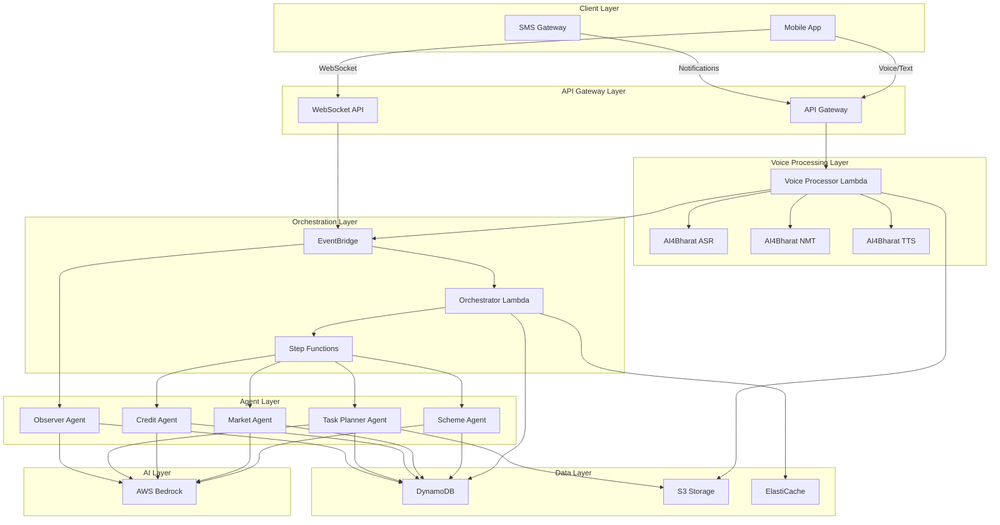

# Design Document: GramSaarthi AI

## Overview

GramSaarthi AI is a voice-first, event-driven multi-agent system designed to bridge the information and execution gap for rural enterprises in India. The system architecture is built around five core principles:

1. **Voice-Native Interaction**: All user interactions prioritize voice input/output using AI4Bharat's ASR, NMT, and TTS capabilities, with support for code-mixed input and transliteration.

2. **Multi-Agent Orchestration**: Specialized agents (Scheme, Market, Credit, Task Planner, Observer) handle domain-specific tasks, coordinated by an intelligent orchestrator that routes requests and manages context.

3. **Event-Driven Architecture**: AWS EventBridge serves as the central nervous system, enabling loose coupling, asynchronous processing, and scalability across all components.

4. **Offline-First Design**: Store-and-forward mechanisms, local caching, and SMS fallbacks ensure the system works reliably in low-connectivity rural environments.

5. **Autonomous Replanning**: An observer loop continuously monitors plan execution, detects obstacles, and triggers replanning without manual intervention.

The system is deployed on AWS using serverless components (Lambda, Step Functions, DynamoDB, S3, Bedrock) to minimize operational overhead and enable elastic scaling.

## Architecture

### High-Level Architecture



### Component Responsibilities

**Client Layer:**
- Mobile App: React Native app with offline-first architecture, local SQLite for plan caching
- SMS Gateway: Twilio integration for critical notifications and fallback communication

**API Gateway Layer:**
- API Gateway: REST endpoints for synchronous operations (authentication, profile management)
- WebSocket API: Real-time bidirectional communication for live updates and streaming responses

**Voice Processing Layer:**
- AI4Bharat ASR: Converts Indic language speech to text (supports Hindi, Tamil, Telugu, Bengali, Marathi)
- AI4Bharat NMT: Translates between Indic languages and handles transliteration
- AI4Bharat TTS: Synthesizes natural-sounding speech in Indic languages
- Voice Processor Lambda: Orchestrates voice pipeline, handles store-and-forward, manages retries

**Orchestration Layer:**
- Orchestrator Lambda: Routes requests to appropriate agents, maintains conversation context, handles multi-agent coordination
- EventBridge: Central event bus for all system events (voice_processed, plan_created, task_completed, etc.)
- Step Functions: Manages long-running workflows (plan generation, scheme application tracking)

**Agent Layer:**
- Scheme Agent: Government scheme knowledge base, eligibility checking, document checklist generation
- Market Agent: Market intelligence, pricing data, buyer network suggestions
- Credit Agent: Financial record structuring, credit readiness assessment, business plan guidance
- Task Planner Agent: Action plan generation with tasks, dependencies, deadlines
- Observer Agent: Monitors plan execution, detects delays/obstacles, triggers replanning

**Data Layer:**
- DynamoDB: Primary data store (enterprises, plans, tasks, conversations, events)
- S3: Object storage (voice recordings, documents, generated reports)
- ElastiCache: Session state, conversation context, frequently accessed data

**AI Layer:**
- AWS Bedrock: LLM operations using Claude 3 for agent reasoning, plan generation, and natural language understanding


## Components and Interfaces

### 1. Voice Processing Pipeline

**Voice Processor Lambda**

```python
class VoiceProcessor:
    def __init__(self, asr_client, nmt_client, tts_client, s3_client, event_bridge):
        self.asr = asr_client
        self.nmt = nmt_client
        self.tts = tts_client
        self.s3 = s3_client
        self.events = event_bridge
    
    def process_voice_input(self, audio_data, user_id, language_preference):
        """
        Process voice input through ASR, NMT, and publish to event bus.
        Handles store-and-forward for offline recordings.
        """
        # Store audio in S3
        audio_key = self.store_audio(audio_data, user_id)
        
        # Transcribe using AI4Bharat ASR
        transcription = self.asr.transcribe(audio_data, source_language=language_preference)
        
        # Handle code-mixed input
        if self.is_code_mixed(transcription):
            transcription = self.normalize_code_mixed(transcription)
        
        # Detect intent and extract entities
        intent = self.detect_intent(transcription)
        
        # Publish event
        self.events.publish({
            'type': 'voice_processed',
            'user_id': user_id,
            'transcription': transcription,
            'intent': intent,
            'audio_key': audio_key,
            'language': language_preference
        })
        
        return {'status': 'processing', 'request_id': audio_key}
    
    def synthesize_response(self, text, language, user_id):
        """
        Convert text response to speech in user's preferred language.
        """
        # Translate if needed
        if language != 'en':
            text = self.nmt.translate(text, target_language=language)
        
        # Synthesize speech
        audio_data = self.tts.synthesize(text, language=language)
        
        # Store and return URL
        audio_url = self.store_audio(audio_data, user_id, is_response=True)
        return audio_url
```

**AI4Bharat Integration**

```python
class AI4BharatClient:
    def __init__(self, api_endpoint, api_key):
        self.endpoint = api_endpoint
        self.api_key = api_key
    
    def transcribe(self, audio_data, source_language):
        """
        Call AI4Bharat ASR API for speech-to-text.
        Supports: hi, ta, te, bn, mr
        """
        response = requests.post(
            f"{self.endpoint}/asr",
            headers={'Authorization': f'Bearer {self.api_key}'},
            json={
                'audio': base64.b64encode(audio_data).decode(),
                'language': source_language,
                'enable_punctuation': True
            }
        )
        return response.json()['transcription']
    
    def translate(self, text, target_language, source_language='en'):
        """
        Call AI4Bharat NMT API for translation.
        """
        response = requests.post(
            f"{self.endpoint}/nmt",
            headers={'Authorization': f'Bearer {self.api_key}'},
            json={
                'text': text,
                'source_language': source_language,
                'target_language': target_language
            }
        )
        return response.json()['translated_text']
    
    def transliterate(self, text, source_script, target_script):
        """
        Convert text from one script to another (e.g., Roman to Devanagari).
        """
        response = requests.post(
            f"{self.endpoint}/transliterate",
            headers={'Authorization': f'Bearer {self.api_key}'},
            json={
                'text': text,
                'source_script': source_script,
                'target_script': target_script
            }
        )
        return response.json()['transliterated_text']
```

### 2. Orchestrator

**Request Router**

```python
class Orchestrator:
    def __init__(self, bedrock_client, context_store, agent_registry):
        self.llm = bedrock_client
        self.context = context_store
        self.agents = agent_registry
    
    def route_request(self, event):
        """
        Analyze intent and route to appropriate agent(s).
        """
        user_id = event['user_id']
        transcription = event['transcription']
        
        # Load conversation context
        context = self.context.get_context(user_id)
        
        # Determine routing using LLM
        routing_decision = self.llm.invoke({
            'model': 'anthropic.claude-3-sonnet',
            'prompt': self.build_routing_prompt(transcription, context),
            'max_tokens': 500
        })
        
        # Parse routing decision
        target_agents = self.parse_routing(routing_decision)
        
        # Execute agents
        if len(target_agents) == 1:
            return self.execute_single_agent(target_agents[0], event, context)
        else:
            return self.execute_multi_agent(target_agents, event, context)
    
    def execute_single_agent(self, agent_name, event, context):
        """
        Execute a single agent and return response.
        """
        agent = self.agents.get(agent_name)
        response = agent.process(event, context)
        
        # Update context
        self.context.update_context(event['user_id'], response)
        
        return response
    
    def execute_multi_agent(self, agent_names, event, context):
        """
        Coordinate multiple agents and synthesize unified response.
        """
        responses = []
        for agent_name in agent_names:
            agent = self.agents.get(agent_name)
            response = agent.process(event, context)
            responses.append(response)
        
        # Synthesize responses using LLM
        unified_response = self.synthesize_responses(responses, event)
        
        # Update context
        self.context.update_context(event['user_id'], unified_response)
        
        return unified_response
```


### 3. Specialized Agents

**Scheme Agent**

```python
class SchemeAgent:
    def __init__(self, bedrock_client, scheme_knowledge_base, dynamodb):
        self.llm = bedrock_client
        self.knowledge_base = scheme_knowledge_base
        self.db = dynamodb
    
    def process(self, event, context):
        """
        Handle scheme-related queries: eligibility, documentation, application guidance.
        """
        query = event['transcription']
        enterprise_profile = self.db.get_enterprise(event['user_id'])
        
        # Retrieve relevant scheme information
        relevant_schemes = self.knowledge_base.search(query, enterprise_profile)
        
        # Generate response using LLM with RAG
        response = self.llm.invoke({
            'model': 'anthropic.claude-3-sonnet',
            'prompt': self.build_scheme_prompt(query, relevant_schemes, enterprise_profile),
            'max_tokens': 2000
        })
        
        return {
            'agent': 'scheme',
            'response': response,
            'schemes': relevant_schemes
        }
    
    def generate_eligibility_checklist(self, scheme_id, enterprise_profile):
        """
        Create a checklist of eligibility criteria for a specific scheme.
        """
        scheme = self.knowledge_base.get_scheme(scheme_id)
        
        checklist = []
        for criterion in scheme['eligibility_criteria']:
            is_met = self.evaluate_criterion(criterion, enterprise_profile)
            checklist.append({
                'criterion': criterion,
                'status': 'met' if is_met else 'not_met',
                'guidance': self.get_guidance(criterion) if not is_met else None
            })
        
        return checklist
    
    def generate_document_checklist(self, scheme_id):
        """
        Create a checklist of required documents for scheme application.
        """
        scheme = self.knowledge_base.get_scheme(scheme_id)
        return scheme['required_documents']
```

**Market Agent**

```python
class MarketAgent:
    def __init__(self, bedrock_client, market_data_store, dynamodb):
        self.llm = bedrock_client
        self.market_data = market_data_store
        self.db = dynamodb
    
    def process(self, event, context):
        """
        Handle market intelligence queries: pricing, demand, buyers.
        """
        query = event['transcription']
        enterprise_profile = self.db.get_enterprise(event['user_id'])
        
        # Get relevant market data
        market_info = self.get_market_intelligence(
            enterprise_profile['product_category'],
            enterprise_profile['location']
        )
        
        # Generate response
        response = self.llm.invoke({
            'model': 'anthropic.claude-3-sonnet',
            'prompt': self.build_market_prompt(query, market_info, enterprise_profile),
            'max_tokens': 2000
        })
        
        return {
            'agent': 'market',
            'response': response,
            'market_data': market_info
        }
    
    def get_market_intelligence(self, product_category, location):
        """
        Retrieve curated market data for product category and location.
        """
        pricing = self.market_data.get_pricing(product_category, location)
        demand_trends = self.market_data.get_demand_trends(product_category)
        buyers = self.market_data.get_potential_buyers(product_category, location)
        
        return {
            'pricing': pricing,
            'demand_trends': demand_trends,
            'potential_buyers': buyers
        }
```

**Credit Agent**

```python
class CreditAgent:
    def __init__(self, bedrock_client, dynamodb):
        self.llm = bedrock_client
        self.db = dynamodb
    
    def process(self, event, context):
        """
        Handle credit readiness queries: financial records, business plans.
        """
        query = event['transcription']
        enterprise_profile = self.db.get_enterprise(event['user_id'])
        financial_records = self.db.get_financial_records(event['user_id'])
        
        # Assess credit readiness
        assessment = self.assess_credit_readiness(financial_records)
        
        # Generate response
        response = self.llm.invoke({
            'model': 'anthropic.claude-3-sonnet',
            'prompt': self.build_credit_prompt(query, assessment, enterprise_profile),
            'max_tokens': 2000
        })
        
        return {
            'agent': 'credit',
            'response': response,
            'assessment': assessment
        }
    
    def assess_credit_readiness(self, financial_records):
        """
        Evaluate completeness and quality of financial records.
        """
        required_documents = [
            'balance_sheet', 'income_statement', 'cash_flow',
            'bank_statements', 'tax_returns', 'business_plan'
        ]
        
        completeness = {}
        for doc in required_documents:
            completeness[doc] = doc in financial_records
        
        score = sum(completeness.values()) / len(required_documents)
        
        return {
            'score': score,
            'completeness': completeness,
            'missing_documents': [doc for doc, present in completeness.items() if not present]
        }
```

**Task Planner Agent**

```python
class TaskPlannerAgent:
    def __init__(self, bedrock_client, dynamodb, s3):
        self.llm = bedrock_client
        self.db = dynamodb
        self.s3 = s3
    
    def process(self, event, context):
        """
        Generate structured action plans with tasks, dependencies, deadlines.
        """
        goal = event['transcription']
        enterprise_profile = self.db.get_enterprise(event['user_id'])
        
        # Generate action plan using LLM
        plan = self.generate_action_plan(goal, enterprise_profile, context)
        
        # Store plan
        plan_id = self.db.create_plan(event['user_id'], plan)
        
        # Cache plan locally (will be synced to mobile)
        self.cache_plan(plan_id, plan)
        
        return {
            'agent': 'planner',
            'response': self.format_plan_summary(plan),
            'plan_id': plan_id,
            'plan': plan
        }
    
    def generate_action_plan(self, goal, enterprise_profile, context):
        """
        Use LLM to generate structured action plan with tasks and dependencies.
        """
        prompt = f"""
        Generate a detailed action plan for the following goal:
        Goal: {goal}
        
        Enterprise Profile: {json.dumps(enterprise_profile)}
        Context: {json.dumps(context)}
        
        Create a structured plan with:
        1. Tasks (discrete, actionable steps)
        2. Dependencies (which tasks must be completed before others)
        3. Deadlines (realistic timelines)
        4. Resources (documents, information, or assistance needed)
        5. Success criteria (how to know the task is complete)
        
        Format as JSON.
        """
        
        response = self.llm.invoke({
            'model': 'anthropic.claude-3-sonnet',
            'prompt': prompt,
            'max_tokens': 3000
        })
        
        plan = json.loads(response)
        
        # Add metadata
        plan['created_at'] = datetime.now().isoformat()
        plan['status'] = 'active'
        plan['goal'] = goal
        
        return plan
```


**Observer Agent**

```python
class ObserverAgent:
    def __init__(self, bedrock_client, dynamodb, event_bridge):
        self.llm = bedrock_client
        self.db = dynamodb
        self.events = event_bridge
    
    def monitor_plans(self):
        """
        Continuously monitor active plans for delays, obstacles, or completion.
        Triggered by EventBridge scheduled rule (every 6 hours).
        """
        active_plans = self.db.get_active_plans()
        
        for plan in active_plans:
            analysis = self.analyze_plan_progress(plan)
            
            if analysis['requires_replanning']:
                self.trigger_replanning(plan, analysis['reason'])
            elif analysis['requires_escalation']:
                self.escalate_to_facilitator(plan, analysis['reason'])
            elif analysis['has_opportunities']:
                self.suggest_acceleration(plan, analysis['opportunities'])
    
    def analyze_plan_progress(self, plan):
        """
        Analyze plan execution status and identify issues or opportunities.
        """
        current_time = datetime.now()
        
        # Check for overdue tasks
        overdue_tasks = [
            task for task in plan['tasks']
            if task['status'] != 'completed' and 
            datetime.fromisoformat(task['deadline']) < current_time
        ]
        
        # Check for blocked tasks
        blocked_tasks = [
            task for task in plan['tasks']
            if task.get('blocked', False)
        ]
        
        # Check for early completions
        early_completions = [
            task for task in plan['tasks']
            if task['status'] == 'completed' and
            datetime.fromisoformat(task['completed_at']) < datetime.fromisoformat(task['deadline'])
        ]
        
        # Use LLM to analyze impact
        analysis_prompt = f"""
        Analyze this action plan's progress:
        
        Plan: {json.dumps(plan)}
        Overdue tasks: {len(overdue_tasks)}
        Blocked tasks: {len(blocked_tasks)}
        Early completions: {len(early_completions)}
        
        Determine:
        1. Does this require replanning? (yes/no and reason)
        2. Does this require facilitator escalation? (yes/no and reason)
        3. Are there opportunities to accelerate? (yes/no and suggestions)
        
        Format as JSON.
        """
        
        response = self.llm.invoke({
            'model': 'anthropic.claude-3-sonnet',
            'prompt': analysis_prompt,
            'max_tokens': 1000
        })
        
        return json.loads(response)
    
    def trigger_replanning(self, plan, reason):
        """
        Publish event to trigger replanning by Task Planner Agent.
        """
        self.events.publish({
            'type': 'replanning_required',
            'plan_id': plan['plan_id'],
            'user_id': plan['user_id'],
            'reason': reason,
            'original_plan': plan
        })
```

### 4. Event-Driven Communication

**Event Types**

```python
# Event schema definitions
EVENT_SCHEMAS = {
    'voice_processed': {
        'user_id': str,
        'transcription': str,
        'intent': str,
        'audio_key': str,
        'language': str,
        'timestamp': str
    },
    'plan_created': {
        'plan_id': str,
        'user_id': str,
        'goal': str,
        'tasks': list,
        'timestamp': str
    },
    'task_completed': {
        'plan_id': str,
        'task_id': str,
        'user_id': str,
        'completed_at': str,
        'timestamp': str
    },
    'task_blocked': {
        'plan_id': str,
        'task_id': str,
        'user_id': str,
        'reason': str,
        'timestamp': str
    },
    'replanning_required': {
        'plan_id': str,
        'user_id': str,
        'reason': str,
        'original_plan': dict,
        'timestamp': str
    },
    'facilitator_escalation': {
        'plan_id': str,
        'user_id': str,
        'facilitator_id': str,
        'reason': str,
        'priority': str,
        'timestamp': str
    }
}
```

**EventBridge Configuration**

```python
# EventBridge rules for routing events to appropriate handlers
EVENTBRIDGE_RULES = [
    {
        'name': 'voice-to-orchestrator',
        'event_pattern': {'detail-type': ['voice_processed']},
        'targets': ['orchestrator-lambda']
    },
    {
        'name': 'plan-to-observer',
        'event_pattern': {'detail-type': ['plan_created', 'task_completed', 'task_blocked']},
        'targets': ['observer-lambda']
    },
    {
        'name': 'replanning-to-planner',
        'event_pattern': {'detail-type': ['replanning_required']},
        'targets': ['task-planner-step-function']
    },
    {
        'name': 'escalation-to-facilitator',
        'event_pattern': {'detail-type': ['facilitator_escalation']},
        'targets': ['facilitator-notification-lambda', 'sms-gateway-lambda']
    },
    {
        'name': 'scheduled-monitoring',
        'schedule': 'rate(6 hours)',
        'targets': ['observer-lambda']
    }
]
```

### 5. Store-and-Forward Mechanism

**Offline Queue Manager**

```python
class OfflineQueueManager:
    def __init__(self, local_db, api_client):
        self.local_db = local_db  # SQLite on mobile
        self.api = api_client
    
    def queue_voice_recording(self, audio_data, metadata):
        """
        Store voice recording locally when offline.
        """
        recording_id = str(uuid.uuid4())
        
        self.local_db.execute("""
            INSERT INTO offline_queue (id, type, data, metadata, status, created_at)
            VALUES (?, ?, ?, ?, ?, ?)
        """, (recording_id, 'voice_recording', audio_data, json.dumps(metadata), 'queued', datetime.now()))
        
        return recording_id
    
    def process_queue(self):
        """
        Process queued items when connectivity is restored.
        Uses exponential backoff for retries.
        """
        queued_items = self.local_db.execute("""
            SELECT * FROM offline_queue WHERE status IN ('queued', 'retrying')
            ORDER BY created_at ASC
        """).fetchall()
        
        for item in queued_items:
            try:
                if item['type'] == 'voice_recording':
                    self.upload_voice_recording(item)
                elif item['type'] == 'task_update':
                    self.sync_task_update(item)
                
                # Mark as completed
                self.local_db.execute("""
                    UPDATE offline_queue SET status = 'completed', processed_at = ?
                    WHERE id = ?
                """, (datetime.now(), item['id']))
                
            except Exception as e:
                # Implement exponential backoff
                retry_count = item.get('retry_count', 0)
                if retry_count < 5:
                    backoff_seconds = 2 ** retry_count
                    next_retry = datetime.now() + timedelta(seconds=backoff_seconds)
                    
                    self.local_db.execute("""
                        UPDATE offline_queue 
                        SET status = 'retrying', retry_count = ?, next_retry_at = ?
                        WHERE id = ?
                    """, (retry_count + 1, next_retry, item['id']))
                else:
                    # Max retries exceeded, mark as failed
                    self.local_db.execute("""
                        UPDATE offline_queue SET status = 'failed', error = ?
                        WHERE id = ?
                    """, (str(e), item['id']))
```


### 6. SMS Fallback System

**SMS Notification Service**

```python
class SMSNotificationService:
    def __init__(self, twilio_client, dynamodb):
        self.twilio = twilio_client
        self.db = dynamodb
    
    def send_task_reminder(self, user_id, task):
        """
        Send SMS reminder for approaching task deadline.
        """
        user = self.db.get_user(user_id)
        
        if not user.get('sms_enabled', True):
            return
        
        message = self.format_task_reminder(task, user['language'])
        
        try:
            self.twilio.messages.create(
                to=user['phone_number'],
                from_=os.environ['TWILIO_PHONE_NUMBER'],
                body=message
            )
            
            self.db.log_notification(user_id, 'sms', 'task_reminder', 'sent')
        except Exception as e:
            self.retry_with_backoff(user_id, message, retry_count=0)
    
    def send_plan_update_notification(self, user_id, plan_id, changes):
        """
        Notify user of plan updates via SMS.
        """
        user = self.db.get_user(user_id)
        
        if not user.get('sms_enabled', True):
            return
        
        message = self.format_plan_update(changes, user['language'])
        
        self.twilio.messages.create(
            to=user['phone_number'],
            from_=os.environ['TWILIO_PHONE_NUMBER'],
            body=message
        )
    
    def retry_with_backoff(self, user_id, message, retry_count):
        """
        Retry SMS delivery with exponential backoff (up to 3 attempts).
        """
        if retry_count >= 3:
            self.db.log_notification(user_id, 'sms', 'failed', 'max_retries_exceeded')
            return
        
        time.sleep(3600 * retry_count)  # 1 hour, 2 hours, 3 hours
        
        try:
            user = self.db.get_user(user_id)
            self.twilio.messages.create(
                to=user['phone_number'],
                from_=os.environ['TWILIO_PHONE_NUMBER'],
                body=message
            )
            self.db.log_notification(user_id, 'sms', 'retry_success', f'attempt_{retry_count + 1}')
        except Exception as e:
            self.retry_with_backoff(user_id, message, retry_count + 1)
```

### 7. Facilitator Dashboard

**Facilitator Service**

```python
class FacilitatorService:
    def __init__(self, dynamodb, event_bridge):
        self.db = dynamodb
        self.events = event_bridge
    
    def get_dashboard_data(self, facilitator_id):
        """
        Retrieve dashboard data for facilitator showing all supported enterprises.
        """
        enterprises = self.db.get_enterprises_by_facilitator(facilitator_id)
        
        dashboard = {
            'total_enterprises': len(enterprises),
            'active_plans': 0,
            'blocked_tasks': [],
            'upcoming_deadlines': [],
            'recent_completions': []
        }
        
        for enterprise in enterprises:
            plans = self.db.get_active_plans(enterprise['user_id'])
            dashboard['active_plans'] += len(plans)
            
            for plan in plans:
                # Find blocked tasks
                blocked = [t for t in plan['tasks'] if t.get('blocked', False)]
                dashboard['blocked_tasks'].extend([{
                    'enterprise': enterprise['name'],
                    'task': t,
                    'plan_id': plan['plan_id']
                } for t in blocked])
                
                # Find upcoming deadlines (within 48 hours)
                upcoming = [
                    t for t in plan['tasks']
                    if t['status'] != 'completed' and
                    datetime.fromisoformat(t['deadline']) - datetime.now() < timedelta(hours=48)
                ]
                dashboard['upcoming_deadlines'].extend([{
                    'enterprise': enterprise['name'],
                    'task': t,
                    'plan_id': plan['plan_id']
                } for t in upcoming])
        
        # Sort by priority
        dashboard['blocked_tasks'].sort(key=lambda x: x['task']['deadline'])
        dashboard['upcoming_deadlines'].sort(key=lambda x: x['task']['deadline'])
        
        return dashboard
    
    def provide_guidance(self, facilitator_id, plan_id, task_id, guidance_text):
        """
        Attach facilitator guidance to a specific task.
        """
        self.db.add_task_guidance(plan_id, task_id, {
            'facilitator_id': facilitator_id,
            'guidance': guidance_text,
            'timestamp': datetime.now().isoformat()
        })
        
        # Notify enterprise
        plan = self.db.get_plan(plan_id)
        self.events.publish({
            'type': 'facilitator_guidance_added',
            'plan_id': plan_id,
            'task_id': task_id,
            'user_id': plan['user_id'],
            'facilitator_id': facilitator_id
        })
```

## Data Models

### DynamoDB Table Schemas

**Enterprises Table**

```python
{
    'PK': 'ENTERPRISE#<user_id>',
    'SK': 'PROFILE',
    'user_id': str,
    'name': str,
    'type': str,  # 'SHG', 'FPO', 'MSME'
    'location': {
        'state': str,
        'district': str,
        'village': str
    },
    'product_category': str,
    'size': str,  # 'micro', 'small', 'medium'
    'facilitator_id': str,
    'language_preference': str,
    'phone_number': str,
    'sms_enabled': bool,
    'created_at': str,
    'updated_at': str
}
```

**Plans Table**

```python
{
    'PK': 'PLAN#<plan_id>',
    'SK': 'METADATA',
    'plan_id': str,
    'user_id': str,
    'goal': str,
    'status': str,  # 'active', 'completed', 'abandoned'
    'created_at': str,
    'updated_at': str,
    'tasks': [
        {
            'task_id': str,
            'description': str,
            'status': str,  # 'pending', 'in_progress', 'completed', 'blocked'
            'deadline': str,
            'dependencies': [str],  # List of task_ids
            'resources': [str],
            'success_criteria': str,
            'blocked': bool,
            'blocked_reason': str,
            'completed_at': str,
            'guidance': [
                {
                    'facilitator_id': str,
                    'guidance': str,
                    'timestamp': str
                }
            ]
        }
    ]
}
```

**Conversations Table**

```python
{
    'PK': 'USER#<user_id>',
    'SK': 'CONVERSATION#<timestamp>',
    'user_id': str,
    'timestamp': str,
    'transcription': str,
    'intent': str,
    'agent': str,
    'response': str,
    'audio_key': str,
    'language': str
}
```

**Scheme Knowledge Base Table**

```python
{
    'PK': 'SCHEME#<scheme_id>',
    'SK': 'METADATA',
    'scheme_id': str,
    'name': str,
    'description': str,
    'eligibility_criteria': [
        {
            'criterion': str,
            'evaluation_logic': str
        }
    ],
    'required_documents': [str],
    'application_process': [
        {
            'step': int,
            'description': str,
            'estimated_duration': str
        }
    ],
    'benefits': str,
    'application_window': {
        'start_date': str,
        'end_date': str
    },
    'target_enterprises': [str],  # 'SHG', 'FPO', 'MSME'
    'updated_at': str
}
```

**Market Data Table**

```python
{
    'PK': 'MARKET#<product_category>',
    'SK': 'LOCATION#<state>#<district>',
    'product_category': str,
    'location': {
        'state': str,
        'district': str
    },
    'pricing': {
        'current_price': float,
        'unit': str,
        'last_updated': str
    },
    'demand_trends': {
        'trend': str,  # 'increasing', 'stable', 'decreasing'
        'seasonal_pattern': str,
        'peak_months': [str]
    },
    'potential_buyers': [
        {
            'name': str,
            'type': str,
            'contact': str,
            'volume_capacity': str
        }
    ]
}
```

**Financial Records Table**

```python
{
    'PK': 'ENTERPRISE#<user_id>',
    'SK': 'FINANCIAL#<record_type>#<date>',
    'user_id': str,
    'record_type': str,  # 'balance_sheet', 'income_statement', 'cash_flow', etc.
    'date': str,
    'data': dict,  # Structured financial data
    's3_key': str,  # Reference to document in S3
    'uploaded_at': str
}
```


## Correctness Properties

*A property is a characteristic or behavior that should hold true across all valid executions of a system—essentially, a formal statement about what the system should do. Properties serve as the bridge between human-readable specifications and machine-verifiable correctness guarantees.*

### Voice Processing Properties

**Property 1: Multi-language transcription correctness**
*For any* audio input in a supported Indic language (Hindi, Tamil, Telugu, Bengali, Marathi), the Voice_Interface should transcribe it to text in the correct language with reasonable accuracy.
**Validates: Requirements 1.1**

**Property 2: Code-mixed input handling**
*For any* transcribed text containing multiple language components, the Voice_Interface should correctly identify all language components present.
**Validates: Requirements 1.2**

**Property 3: Transliteration round-trip**
*For any* valid text in native script, transliterating to Roman script and back should produce equivalent text.
**Validates: Requirements 1.3**

**Property 4: Translation produces correct target language**
*For any* response text and target Indic language, the Voice_Interface should produce a translation in the specified target language.
**Validates: Requirements 1.4**

**Property 5: Speech synthesis produces audio**
*For any* text and target Indic language, the Voice_Interface should synthesize non-empty audio output.
**Validates: Requirements 1.5**

**Property 6: Language switching preserves context**
*For any* conversation where the user switches languages, the system should maintain conversation context across the language switch.
**Validates: Requirements 1.7**

### Store-and-Forward Properties

**Property 7: Offline recording storage**
*For any* voice input recorded while offline, the system should store it locally and make it available for transmission when connectivity is restored.
**Validates: Requirements 2.1, 2.2**

**Property 8: Exponential backoff retry behavior**
*For any* transmission failure, the system should retry with exponentially increasing delays (2^n seconds) up to a maximum of 5 attempts.
**Validates: Requirements 2.3**

**Property 9: Queue status visibility**
*For any* queued voice recordings, the system should display accurate queue status (count, size, transmission state) to the user.
**Validates: Requirements 2.4**

**Property 10: Offline processing notification**
*For any* successfully processed recording when the app is inactive, the system should send an SMS notification to the user.
**Validates: Requirements 2.5**

### Orchestration Properties

**Property 11: Intent-based routing correctness**
*For any* user query, the Orchestrator should route it to the agent(s) whose domain matches the detected intent.
**Validates: Requirements 3.1**

**Property 12: Multi-agent response synthesis**
*For any* query requiring multiple agents, the Orchestrator should produce a unified response that incorporates information from all relevant agents.
**Validates: Requirements 3.2**

**Property 13: Fallback escalation on agent failure**
*For any* query that an agent cannot handle, the Orchestrator should escalate to a fallback mechanism or facilitator.
**Validates: Requirements 3.3**

**Property 14: Context preservation across agent handoffs**
*For any* multi-turn conversation involving agent switches, conversation context should be maintained and accessible to all agents.
**Validates: Requirements 3.4**

### Scheme Agent Properties

**Property 15: Scheme relevance matching**
*For any* enterprise profile, the Scheme_Agent should return only schemes where the enterprise meets the target criteria (type, location, size).
**Validates: Requirements 4.1**

**Property 16: Complete eligibility checklist generation**
*For any* government scheme, the Scheme_Agent should generate a checklist containing all eligibility criteria and required documents defined for that scheme.
**Validates: Requirements 4.2**

**Property 17: Structured scheme application plan**
*For any* scheme application request, the Scheme_Agent should create an action plan with all application stages, deadlines, and required documents.
**Validates: Requirements 4.3**

**Property 18: Knowledge base update propagation**
*For any* scheme guideline change, the Scheme_Agent should update its knowledge base and notify all users with active plans for that scheme.
**Validates: Requirements 4.4**

**Property 19: Missing document guidance completeness**
*For any* set of missing required documents, the Scheme_Agent should provide guidance for obtaining each missing document.
**Validates: Requirements 4.5**

**Property 20: Scheme ranking consistency**
*For any* set of applicable schemes, the Scheme_Agent should rank them consistently based on defined relevance and accessibility criteria.
**Validates: Requirements 4.6**

### Market Agent Properties

**Property 21: Market data retrieval for supported categories**
*For any* product category in the curated feed and valid location, the Market_Agent should return current pricing data.
**Validates: Requirements 5.1**

**Property 22: Trend presentation when available**
*For any* product category with available demand trends, the Market_Agent should include trend analysis and seasonal patterns in the response.
**Validates: Requirements 5.2**

**Property 23: Buyer suggestion provision**
*For any* product category and location, the Market_Agent should suggest at least one potential buyer network or connection strategy.
**Validates: Requirements 5.3**

**Property 24: Market change notification targeting**
*For any* significant market condition change, the Market_Agent should notify only enterprises whose product category is affected by the change.
**Validates: Requirements 5.4**

**Property 25: Unsupported category handling**
*For any* product category not in the curated feed, the Market_Agent should inform the user and suggest similar supported categories.
**Validates: Requirements 5.5**

### Credit Agent Properties

**Property 26: Credit readiness assessment accuracy**
*For any* set of financial records, the Credit_Agent should accurately calculate completeness score as (present_documents / required_documents).
**Validates: Requirements 6.1**

**Property 27: Missing information task list completeness**
*For any* incomplete financial records, the Credit_Agent should generate a task list containing all missing required documents.
**Validates: Requirements 6.2**

**Property 28: Business plan guidance coverage**
*For any* business plan request, the Credit_Agent should provide guidance covering revenue projections, cost structures, and growth plans.
**Validates: Requirements 6.3**

**Property 29: Financial data formatting compliance**
*For any* provided financial data, the Credit_Agent should structure it into formats that match lending institution requirements.
**Validates: Requirements 6.4**

**Property 30: Credit improvement notification**
*For any* improvement in credit readiness score, the Credit_Agent should notify the user and suggest appropriate next steps.
**Validates: Requirements 6.5**

### Task Planning Properties

**Property 31: Action plan structure completeness**
*For any* user goal, the Task_Planner_Agent should generate an Action_Plan containing tasks, dependencies, deadlines, resources, and success criteria.
**Validates: Requirements 7.1**

**Property 32: Dependency relationship explicitness**
*For any* task with prerequisites, the Action_Plan should explicitly list all prerequisite task IDs in the dependencies field.
**Validates: Requirements 7.2**

**Property 33: Resource requirement listing**
*For any* task requiring specific resources or documents, the Action_Plan should list all requirements in the resources field.
**Validates: Requirements 7.3**

**Property 34: Critical deadline highlighting**
*For any* task with a deadline within 7 days or marked as critical, the Action_Plan should include a highlight flag.
**Validates: Requirements 7.4**

**Property 35: Plan caching on generation**
*For any* generated or updated Action_Plan, the system should store it in the Plan_Cache before returning the response.
**Validates: Requirements 7.5**

**Property 36: Completed task preservation on modification**
*For any* plan modification request, all tasks with status 'completed' should remain unchanged in the updated plan.
**Validates: Requirements 7.6**

### Observer Agent Properties

**Property 37: Deadline miss detection**
*For any* task with deadline in the past and status not 'completed', the Observer_Agent should detect it as overdue and analyze impact on dependent tasks.
**Validates: Requirements 8.1**

**Property 38: Obstacle-triggered replanning**
*For any* user-reported obstacle on a task, the Observer_Agent should publish a replanning_required event.
**Validates: Requirements 8.2**

**Property 39: Replanning coordination**
*For any* replanning_required event, the Observer_Agent should coordinate with Task_Planner_Agent to generate an updated Action_Plan.
**Validates: Requirements 8.3**

**Property 40: Plan update notification completeness**
*For any* plan update, the Observer_Agent should send notifications to both the enterprise user and their assigned facilitator.
**Validates: Requirements 8.4**

**Property 41: Early completion opportunity identification**
*For any* task completed before its deadline, the Observer_Agent should analyze dependent tasks for acceleration opportunities.
**Validates: Requirements 8.5**

**Property 42: Critical path escalation**
*For any* task on the critical path that is overdue or blocked, the Observer_Agent should publish a facilitator_escalation event.
**Validates: Requirements 8.6**

### Event-Driven Architecture Properties

**Property 43: Event publishing for inter-component communication**
*For any* inter-component communication need, the system should publish a properly formatted event to the Event_Bus.
**Validates: Requirements 9.1**

**Property 44: Event routing to subscribers**
*For any* published event, the Event_Bus should route it to all components subscribed to that event type.
**Validates: Requirements 9.2**

**Property 45: State persistence round-trip**
*For any* system state stored in DynamoDB, retrieving it should produce an equivalent state object.
**Validates: Requirements 9.4**

**Property 46: File storage round-trip**
*For any* file stored in S3, retrieving it should produce identical file contents.
**Validates: Requirements 9.5**

### SMS Notification Properties

**Property 47: Task deadline reminder timing**
*For any* task with deadline within 48 hours and status not 'completed', the system should send an SMS reminder to the user.
**Validates: Requirements 10.1**

**Property 48: Plan update SMS notification**
*For any* plan updated by the Observer_Agent, the system should send an SMS notification with a summary of changes.
**Validates: Requirements 10.2**

**Property 49: Scheme deadline alert**
*For any* scheme with application window closing within 7 days, the system should send an SMS alert to users with active plans for that scheme.
**Validates: Requirements 10.3**

**Property 50: Market change notification targeting**
*For any* significant market condition change, the system should send SMS notifications only to enterprises in the affected product category.
**Validates: Requirements 10.4**

**Property 51: SMS retry with backoff**
*For any* failed SMS delivery, the system should retry up to 3 times with 1-hour intervals between attempts.
**Validates: Requirements 10.5**

**Property 52: SMS opt-out respect**
*For any* user with sms_enabled=false, the system should not send SMS notifications and should use in-app notifications instead.
**Validates: Requirements 10.6**

### Facilitator Workflow Properties

**Property 53: Facilitator dashboard completeness**
*For any* facilitator, their dashboard should display all enterprises where facilitator_id matches their ID.
**Validates: Requirements 11.1**

**Property 54: Blocked task flagging**
*For any* task with blocked=true, it should appear in the facilitator's dashboard blocked_tasks list.
**Validates: Requirements 11.2**

**Property 55: Guidance attachment**
*For any* facilitator guidance provided, it should be stored in the task's guidance array and be retrievable.
**Validates: Requirements 11.3**

**Property 56: Help request notification completeness**
*For any* enterprise help request, the system should send notifications to the facilitator via both SMS and in-app channels.
**Validates: Requirements 11.4**

**Property 57: Facilitator update notification**
*For any* Action_Plan update made by a facilitator, the system should notify the enterprise user.
**Validates: Requirements 11.5**

**Property 58: Enterprise prioritization consistency**
*For any* set of enterprises needing attention, the facilitator dashboard should prioritize them consistently by urgency (deadline proximity) and impact (critical path).
**Validates: Requirements 11.6**

### Local Caching Properties

**Property 59: Plan caching on generation or update**
*For any* Action_Plan generated or updated, the system should cache it locally on the user's device.
**Validates: Requirements 12.1**

**Property 60: Offline plan accessibility**
*For any* cached Action_Plan, it should be displayable when the device is offline.
**Validates: Requirements 12.2**

**Property 61: Offline task update queueing**
*For any* task marked complete while offline, the update should be queued in the offline_queue table with status 'queued'.
**Validates: Requirements 12.3**

**Property 62: Synchronization on connectivity restoration**
*For any* queued update in offline_queue, it should be processed and synced to the backend when connectivity is restored.
**Validates: Requirements 12.4**

**Property 63: Conflict resolution prioritizes backend**
*For any* synchronization conflict between local and backend state, the backend state should be preserved and the user should be notified.
**Validates: Requirements 12.5**

**Property 64: Cache eviction policy**
*For any* full cache, the system should retain plans ordered by most recent access and archive the least recently accessed plans.
**Validates: Requirements 12.6**

### Enterprise Profile Properties

**Property 65: Registration data collection completeness**
*For any* new enterprise registration, the system should collect all required fields (name, type, location, product_category, size, phone_number, language_preference).
**Validates: Requirements 14.1**

**Property 66: Profile update propagation**
*For any* enterprise profile update, the changes should be reflected in all agent responses for that user within the next request.
**Validates: Requirements 14.2**

**Property 67: Incomplete profile validation**
*For any* plan generation request with an incomplete enterprise profile, the system should prompt for missing required fields before generating the plan.
**Validates: Requirements 14.3**

**Property 68: Sensitive data encryption at rest**
*For any* sensitive profile field (phone_number, financial data), it should be encrypted using AWS KMS when stored in DynamoDB.
**Validates: Requirements 14.4**

**Property 69: Profile deletion within timeframe**
*For any* profile deletion request, all personal data should be removed from the system within 30 days.
**Validates: Requirements 14.5**

### Progress Tracking Properties

**Property 70: Completion percentage accuracy**
*For any* Action_Plan, the displayed completion percentage should equal (completed_tasks / total_tasks) * 100.
**Validates: Requirements 15.1**

**Property 71: Real-time progress metric updates**
*For any* task status change to 'completed', the plan's progress metrics should update within 1 second.
**Validates: Requirements 15.2**

**Property 72: Milestone recording**
*For any* achieved milestone (scheme approval, market entry, credit access), it should be recorded in the user's milestone history.
**Validates: Requirements 15.3**

**Property 73: Historical timeline completeness**
*For any* user, their historical timeline should include all completed plans with outcomes.
**Validates: Requirements 15.4**

**Property 74: Analytics insight generation**
*For any* aggregated dataset of plans, the system should generate insights identifying common bottlenecks and success patterns.
**Validates: Requirements 15.5**

### Security Properties

**Property 75: Secure authentication mechanism usage**
*For any* authentication attempt, the system should use OTP-based or OAuth mechanisms.
**Validates: Requirements 16.1**

**Property 76: TLS encryption for transmission**
*For any* data transmitted over the network, the system should use TLS 1.2 or higher.
**Validates: Requirements 16.2**

**Property 77: KMS encryption for sensitive storage**
*For any* sensitive data field stored in DynamoDB, it should be encrypted using AWS KMS.
**Validates: Requirements 16.3**

**Property 78: Access audit logging**
*For any* data access operation, the system should create an audit log entry with timestamp, user_id, and resource accessed.
**Validates: Requirements 16.4**

**Property 79: Facilitator authorization verification**
*For any* facilitator access to enterprise data, the system should verify the facilitator_id matches the enterprise's assigned facilitator before allowing access.
**Validates: Requirements 16.5**

**Property 80: Data retention policy enforcement**
*For any* data subject to retention policy, the system should automatically archive or delete it according to the policy timeframe.
**Validates: Requirements 16.6**

### Error Handling Properties

**Property 81: API retry with exponential backoff**
*For any* failed API call, the system should retry with exponentially increasing delays (2^n seconds) up to 5 attempts.
**Validates: Requirements 17.1**

**Property 82: Service unavailability error messaging**
*For any* critical service unavailability, the system should display a user-friendly error message and suggest alternative actions.
**Validates: Requirements 17.2**

**Property 83: Transcription failure clarification request**
*For any* voice transcription failure, the Voice_Interface should request the user to repeat their input.
**Validates: Requirements 17.3**

**Property 84: Agent failure escalation**
*For any* agent processing failure, the Orchestrator should log the error and escalate to a fallback mechanism.
**Validates: Requirements 17.4**

**Property 85: Synchronization failure queueing**
*For any* data synchronization failure, the system should queue the operation for retry when conditions improve.
**Validates: Requirements 17.5**

**Property 86: System health degradation alerting**
*For any* system health metric falling below threshold, the system should trigger an alert to the operations team.
**Validates: Requirements 17.6**

### Feedback Loop Properties

**Property 87: Plan completion feedback request**
*For any* Action_Plan with status changed to 'completed', the system should request feedback from the user.
**Validates: Requirements 18.1**

**Property 88: Issue reporting mechanism availability**
*For any* user session, the system should provide an accessible mechanism to report issues with context.
**Validates: Requirements 18.2**

**Property 89: Feedback storage with metadata**
*For any* submitted feedback, the system should store it with metadata (user_id, plan_id, timestamp, user_type).
**Validates: Requirements 18.3**

**Property 90: Pattern-based insight surfacing**
*For any* feedback dataset with identifiable patterns (e.g., >10 similar issues), the system should generate insights for the product team.
**Validates: Requirements 18.4**

**Property 91: Poor rating flagging**
*For any* agent response rated below 3/5, the system should flag it for review.
**Validates: Requirements 18.5**

**Property 92: Usage metrics anonymization**
*For any* collected usage metrics, the system should anonymize user identifiers before aggregation.
**Validates: Requirements 18.6**

### Multilingual Content Properties

**Property 93: Multilingual content creation support**
*For any* content creation operation, the system should support simultaneous entry in all supported Indic languages.
**Validates: Requirements 19.1**

**Property 94: Content update flagging across languages**
*For any* content update in one language, the system should flag corresponding content in other languages with needs_review=true.
**Validates: Requirements 19.2**

**Property 95: Language preference content serving**
*For any* information request, the system should serve content in the user's language_preference if available.
**Validates: Requirements 19.3**

**Property 96: Fallback translation for unavailable content**
*For any* content not available in the user's preferred language, the system should use NMT to translate from the source language.
**Validates: Requirements 19.4**

**Property 97: Machine translation marking**
*For any* auto-generated translation, the system should mark it with is_machine_translated=true.
**Validates: Requirements 19.5**

### Asynchronous Processing Properties

**Property 98: Immediate voice input acknowledgment**
*For any* voice input received, the system should return an acknowledgment response within 500ms.
**Validates: Requirements 20.1**

**Property 99: Processing completion notification**
*For any* completed asynchronous processing, the system should send a notification to the user via push or SMS.
**Validates: Requirements 20.2**

**Property 100: Fair queue processing order**
*For any* set of queued requests, the system should process them in FIFO order within each priority level.
**Validates: Requirements 20.3**

**Property 101: Long-running process status updates**
*For any* processing operation exceeding 30 seconds, the system should provide status updates every 15 seconds.
**Validates: Requirements 20.4**

**Property 102: Processing failure retry and notification**
*For any* processing failure, the system should retry automatically and notify the user only if all retries fail.
**Validates: Requirements 20.5**

**Property 103: Load-based throttling with wait time display**
*For any* high load condition (>80% capacity), the system should throttle new requests and display estimated wait times.
**Validates: Requirements 20.6**


## Error Handling

### Error Categories and Strategies

**1. Voice Processing Errors**

```python
class VoiceProcessingError(Exception):
    """Base class for voice processing errors"""
    pass

class TranscriptionError(VoiceProcessingError):
    """ASR failed to transcribe audio"""
    def handle(self):
        return {
            'error_type': 'transcription_failed',
            'user_message': 'I couldn't understand that. Could you please repeat?',
            'action': 'request_retry',
            'retry_count': self.retry_count
        }

class TranslationError(VoiceProcessingError):
    """NMT failed to translate text"""
    def handle(self):
        return {
            'error_type': 'translation_failed',
            'user_message': 'I had trouble translating. Showing in English.',
            'action': 'fallback_to_english',
            'original_language': self.target_language
        }

class SynthesisError(VoiceProcessingError):
    """TTS failed to synthesize speech"""
    def handle(self):
        return {
            'error_type': 'synthesis_failed',
            'user_message': 'Voice output unavailable. Showing text response.',
            'action': 'text_only_response'
        }
```

**2. Network and Connectivity Errors**

```python
class NetworkError(Exception):
    """Base class for network errors"""
    pass

class ConnectionTimeoutError(NetworkError):
    """Request timed out"""
    def handle(self):
        if self.retry_count < 5:
            backoff_seconds = 2 ** self.retry_count
            return {
                'error_type': 'connection_timeout',
                'action': 'retry_with_backoff',
                'backoff_seconds': backoff_seconds,
                'retry_count': self.retry_count + 1
            }
        else:
            return {
                'error_type': 'connection_timeout',
                'action': 'queue_for_later',
                'user_message': 'Network unavailable. Your request will be processed when connection is restored.'
            }

class ServiceUnavailableError(NetworkError):
    """External service is down"""
    def handle(self):
        return {
            'error_type': 'service_unavailable',
            'user_message': 'Service temporarily unavailable. Please try again in a few minutes.',
            'action': 'show_cached_data_if_available',
            'alert_ops_team': True
        }
```

**3. Agent Processing Errors**

```python
class AgentError(Exception):
    """Base class for agent errors"""
    pass

class IntentDetectionError(AgentError):
    """Could not determine user intent"""
    def handle(self):
        return {
            'error_type': 'intent_unclear',
            'user_message': 'I\'m not sure I understood. Could you rephrase that?',
            'action': 'request_clarification',
            'suggestions': self.get_common_intents()
        }

class AgentProcessingError(AgentError):
    """Agent failed to process request"""
    def handle(self):
        return {
            'error_type': 'agent_processing_failed',
            'user_message': 'I encountered an issue. Let me connect you with a facilitator.',
            'action': 'escalate_to_facilitator',
            'log_error': True,
            'context': self.context
        }

class InsufficientDataError(AgentError):
    """Not enough data to fulfill request"""
    def handle(self):
        return {
            'error_type': 'insufficient_data',
            'user_message': 'I need more information to help with that.',
            'action': 'request_missing_data',
            'missing_fields': self.missing_fields
        }
```

**4. Data Errors**

```python
class DataError(Exception):
    """Base class for data errors"""
    pass

class ValidationError(DataError):
    """Data failed validation"""
    def handle(self):
        return {
            'error_type': 'validation_failed',
            'user_message': f'Please check: {", ".join(self.validation_errors)}',
            'action': 'request_correction',
            'invalid_fields': self.validation_errors
        }

class SyncConflictError(DataError):
    """Local and remote data conflict"""
    def handle(self):
        return {
            'error_type': 'sync_conflict',
            'user_message': 'Your data was updated elsewhere. Showing latest version.',
            'action': 'use_remote_data',
            'notify_user': True,
            'local_version': self.local_data,
            'remote_version': self.remote_data
        }
```

### Error Recovery Strategies

**Exponential Backoff Implementation**

```python
def retry_with_exponential_backoff(func, max_retries=5):
    """
    Retry a function with exponential backoff.
    """
    for attempt in range(max_retries):
        try:
            return func()
        except RetryableError as e:
            if attempt == max_retries - 1:
                raise
            
            backoff_seconds = 2 ** attempt
            time.sleep(backoff_seconds)
            
            logger.info(f"Retry attempt {attempt + 1}/{max_retries} after {backoff_seconds}s")
    
    raise MaxRetriesExceededError(f"Failed after {max_retries} attempts")
```

**Circuit Breaker Pattern**

```python
class CircuitBreaker:
    """
    Prevent cascading failures by stopping requests to failing services.
    """
    def __init__(self, failure_threshold=5, timeout=60):
        self.failure_threshold = failure_threshold
        self.timeout = timeout
        self.failure_count = 0
        self.last_failure_time = None
        self.state = 'closed'  # closed, open, half_open
    
    def call(self, func):
        if self.state == 'open':
            if time.time() - self.last_failure_time > self.timeout:
                self.state = 'half_open'
            else:
                raise CircuitBreakerOpenError("Service circuit breaker is open")
        
        try:
            result = func()
            if self.state == 'half_open':
                self.state = 'closed'
                self.failure_count = 0
            return result
        except Exception as e:
            self.failure_count += 1
            self.last_failure_time = time.time()
            
            if self.failure_count >= self.failure_threshold:
                self.state = 'open'
            
            raise
```

### Graceful Degradation

**Fallback Mechanisms**

1. **Voice Processing Fallback**: If ASR fails, accept text input
2. **Translation Fallback**: If NMT fails, show English version
3. **Agent Fallback**: If specialized agent fails, use general agent or escalate to facilitator
4. **Data Fallback**: If live data unavailable, show cached data with timestamp
5. **Notification Fallback**: If push notification fails, send SMS; if SMS fails, queue for in-app

**Example Fallback Chain**

```python
def get_market_data_with_fallback(product_category, location):
    """
    Try multiple data sources with fallback.
    """
    try:
        # Try live market data API
        return market_api.get_current_data(product_category, location)
    except ServiceUnavailableError:
        try:
            # Fallback to cached data
            cached_data = cache.get(f"market:{product_category}:{location}")
            if cached_data and cached_data['age'] < 86400:  # Less than 24 hours old
                cached_data['is_cached'] = True
                cached_data['cached_at'] = cached_data['timestamp']
                return cached_data
        except CacheError:
            # Fallback to default regional data
            return market_api.get_regional_average(location['state'])
```

## Testing Strategy

### Dual Testing Approach

The system requires both unit testing and property-based testing for comprehensive coverage:

- **Unit tests**: Verify specific examples, edge cases, and error conditions
- **Property tests**: Verify universal properties across all inputs
- Both approaches are complementary and necessary

### Property-Based Testing

**Framework**: Use `hypothesis` for Python components

**Configuration**:
- Minimum 100 iterations per property test
- Each test must reference its design document property
- Tag format: `# Feature: gramsaarthi-ai, Property {number}: {property_text}`

**Example Property Test**

```python
from hypothesis import given, strategies as st
import pytest

# Feature: gramsaarthi-ai, Property 3: Transliteration round-trip
@given(st.text(alphabet=st.characters(whitelist_categories=('Ll', 'Lu')), min_size=1))
def test_transliteration_round_trip(native_text):
    """
    For any valid text in native script, transliterating to Roman script 
    and back should produce equivalent text.
    """
    # Transliterate to Roman
    roman_text = ai4bharat_client.transliterate(
        native_text, 
        source_script='devanagari', 
        target_script='roman'
    )
    
    # Transliterate back to native
    result_text = ai4bharat_client.transliterate(
        roman_text,
        source_script='roman',
        target_script='devanagari'
    )
    
    # Should be equivalent (allowing for minor normalization differences)
    assert normalize(result_text) == normalize(native_text)

# Feature: gramsaarthi-ai, Property 8: Exponential backoff retry behavior
@given(st.integers(min_value=0, max_value=4))
def test_exponential_backoff_timing(retry_attempt):
    """
    For any transmission failure, the system should retry with exponentially 
    increasing delays (2^n seconds) up to a maximum of 5 attempts.
    """
    expected_delay = 2 ** retry_attempt
    
    start_time = time.time()
    queue_manager.retry_transmission(mock_item, retry_attempt)
    actual_delay = time.time() - start_time
    
    # Allow 10% tolerance for timing
    assert abs(actual_delay - expected_delay) < expected_delay * 0.1

# Feature: gramsaarthi-ai, Property 31: Action plan structure completeness
@given(st.text(min_size=10))
def test_action_plan_completeness(goal):
    """
    For any user goal, the Task_Planner_Agent should generate an Action_Plan 
    containing tasks, dependencies, deadlines, resources, and success criteria.
    """
    enterprise_profile = create_test_enterprise()
    
    plan = task_planner.generate_action_plan(goal, enterprise_profile, {})
    
    # Verify all required fields are present
    assert 'tasks' in plan
    assert len(plan['tasks']) > 0
    
    for task in plan['tasks']:
        assert 'task_id' in task
        assert 'description' in task
        assert 'deadline' in task
        assert 'dependencies' in task
        assert 'resources' in task
        assert 'success_criteria' in task
```

### Unit Testing

**Framework**: Use `pytest` for Python components

**Focus Areas**:
- Specific examples demonstrating correct behavior
- Edge cases (empty input, boundary values, special characters)
- Error conditions and exception handling
- Integration points between components

**Example Unit Tests**

```python
def test_scheme_agent_returns_relevant_schemes_for_shg():
    """Test that SHG enterprises get SHG-relevant schemes."""
    enterprise = {
        'type': 'SHG',
        'location': {'state': 'Maharashtra'},
        'product_category': 'food_processing'
    }
    
    schemes = scheme_agent.get_relevant_schemes(enterprise)
    
    assert len(schemes) > 0
    assert all(scheme['target_enterprises'] in [['SHG'], ['SHG', 'FPO']] for scheme in schemes)

def test_offline_queue_handles_empty_storage():
    """Test edge case: offline queue with no storage space."""
    queue_manager = OfflineQueueManager(local_db, api_client)
    
    # Fill storage to capacity
    fill_storage_to_capacity()
    
    # Attempt to queue new recording
    with pytest.raises(StorageFullError) as exc_info:
        queue_manager.queue_voice_recording(audio_data, metadata)
    
    assert "storage full" in str(exc_info.value).lower()

def test_observer_escalates_critical_path_delays():
    """Test that observer escalates when critical path tasks are delayed."""
    plan = create_plan_with_critical_path()
    
    # Mark critical task as overdue
    plan['tasks'][0]['deadline'] = (datetime.now() - timedelta(days=1)).isoformat()
    plan['tasks'][0]['is_critical_path'] = True
    
    analysis = observer_agent.analyze_plan_progress(plan)
    
    assert analysis['requires_escalation'] == True
    assert 'critical path' in analysis['reason'].lower()
```

### Integration Testing

**Test Scenarios**:
1. End-to-end voice query processing (voice → transcription → agent → response → TTS)
2. Offline-to-online synchronization flow
3. Multi-agent coordination for complex queries
4. Observer-triggered replanning workflow
5. Facilitator escalation and intervention flow

**Example Integration Test**

```python
@pytest.mark.integration
def test_end_to_end_scheme_query_flow():
    """Test complete flow from voice input to scheme recommendation."""
    # Setup
    user_id = create_test_user(language='hi')
    audio_data = load_test_audio('scheme_query_hindi.wav')
    
    # Step 1: Process voice input
    response = voice_processor.process_voice_input(audio_data, user_id, 'hi')
    assert response['status'] == 'processing'
    
    # Step 2: Wait for async processing
    wait_for_event('voice_processed', timeout=10)
    
    # Step 3: Verify orchestrator routed to scheme agent
    events = get_events_for_user(user_id)
    assert any(e['agent'] == 'scheme' for e in events)
    
    # Step 4: Verify scheme recommendations generated
    conversation = get_latest_conversation(user_id)
    assert 'schemes' in conversation['response']
    assert len(conversation['response']['schemes']) > 0
    
    # Step 5: Verify TTS audio generated
    assert conversation['audio_url'] is not None
    audio_response = requests.get(conversation['audio_url'])
    assert audio_response.status_code == 200
    assert len(audio_response.content) > 0
```

### Performance Testing

**Key Metrics**:
- Voice processing latency: < 3 seconds (ASR + NMT + agent processing)
- API response time: < 500ms for synchronous endpoints
- Event processing latency: < 1 second from publish to handler execution
- Offline sync time: < 10 seconds for 10 queued items
- SMS delivery time: < 30 seconds

**Load Testing**:
- Simulate 100 concurrent users
- Test queue processing under high load
- Verify graceful degradation under resource constraints

### Monitoring and Observability

**Metrics to Track**:
- Voice processing success rate
- Agent routing accuracy
- Plan completion rate
- Offline sync success rate
- SMS delivery success rate
- Error rates by category
- API latency percentiles (p50, p95, p99)

**Alerting Thresholds**:
- Error rate > 5%: Warning
- Error rate > 10%: Critical
- API latency p95 > 2 seconds: Warning
- Voice processing failure rate > 10%: Critical
- SMS delivery failure rate > 5%: Warning

**Logging Strategy**:
- Structured JSON logs with correlation IDs
- Log all agent decisions with reasoning
- Log all error conditions with full context
- Audit log for all data access
- Performance metrics for all operations

